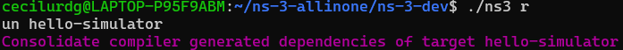
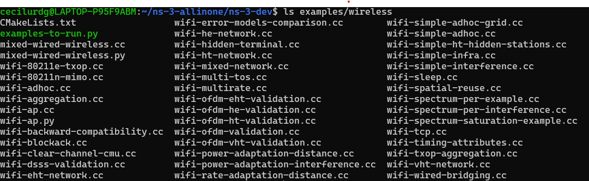
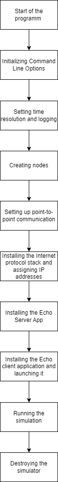

# <center> Assignment 2 </center>

- [ Assignment 2 ](#-assignment-2-)
  - [1. About ns-3](#1-about-ns-3)
    - [1.1. Definition](#11-definition)
    - [1.2. Key abstraction](#12-key-abstraction)
  - [2. Installation process](#2-installation-process)
  - [3. First simulation](#3-first-simulation)
  - [4. Wifi Simple Ht Hidden Stations simulation](#4-wifi-simple-ht-hidden-stations-simulation)

## 1. About ns-3

### 1.1. Definition

The ns-3 simulator is a discrete-event network simulator targeted primarily for research and educational use. It allows users to simulate complex network scenarios and evaluate the performance of networking protocols and algorithms in a controlled environment. ns-3 is an open-source project developed and maintained by a community of researchers and engineers. It provides a wide range of models for simulating various networking technologies, including wired and wireless networks, Internet protocols, routing algorithms, and traffic generators. The simulator is written in C++ and offers Python bindings for easier scripting and simulation configuration.

### 1.2. Key abstraction

In ns-3, several key abstractions form the foundation for creating and managing network simulations. Here's a brief overview:

1. Node: In ns-3, a computing device within the simulated network is termed as a "node." Nodes serve as the basic unit for modeling various functionalities and behaviors within the network simulation.

2. Application: Applications in ns-3 represent user programs that drive activities within the simulated network. These applications run on ns-3 nodes and facilitate the simulation of real-world network scenarios.

3. Channel: The concept of a "channel" in ns-3 refers to the medium Node: In ns-3, a computing device within the simulated network is termed as a "node." Nodes serve as the basic unit for modeling various functionalities and behaviors within the network simulation.

4. Application: Applications in ns-3 represent user programs that drive activities within the simulated network. These applications run on ns-3 nodes and facilitate the simulation of real-world network scenarios.

5. Channel: The concept of a "channel" in ns-3 refers to the medium through which data flows within the simulated network. Channels connect nodes and facilitate communication, with specialized channel classes available for different network models.

6. Net Device: Net devices in ns-3 encompass both software drivers and simulated hardware required for communication between nodes via channels. These devices are essential for enabling nodes to interact within the simulated network environment.

7. Topology Helpers: Topology helpers simplify the process of setting up complex network configurations within ns-3 simulations. These helper objects streamline tasks such as connecting net devices to nodes and channels, assigning IP addresses, and more, making network simulation setup more efficient.hrough which data flows within the simulated network. Channels connect nodes and facilitate communication, with specialized channel classes available for different network models.

8. Net Device: Net devices in ns-3 encompass both software drivers and simulated hardware required for communication between nodes via channels. These devices are essential for enabling nodes to interact within the simulated network environment.

9. Topology Helpers: Topology helpers simplify the process of setting up complex network configurations within ns-3 simulations. These helper objects streamline tasks such as connecting net devices to nodes and channels, assigning IP addresses, and more, making network simulation setup more efficient.

## 2. Installation process

Firstly, we need to install the required dependencies for ns-3.

```bash
sudo apt-get update
sudo apt-get install -y git vim g++ python3-pip cmake
sudo apt-get install -y libc6-dev sqlite sqlite3 libsqlite3-dev
sudo apt-get install gir1.2-goocanvas-2.0 python3-gi python3-gi-cairo python3-pygraphviz gir1.2-gtk-3.0 ipython3
python3 -m pip install --user cppyy
```

After that, we can proceed with the installation of ns-3.

```bash
git clone https://gitlab.com/nsnam/ns-3-dev.git
cd ns-3-dev
./ns3 configure --enable-examples --enable-tests
./ns3 build
./ns3 run first
```

Here, we have cloned the ns-3 repository, configured the build with examples and tests enabled, built the ns-3 project, and run the first example simulation. As a result, we get the following output:

<p align="center">
  
</p>

## 3. First simulation

Let's explore the structure of a basic point-to-point network simulation in ns-3. This will serve as a useful example to understand the core concepts and components of ns-3 and help us get started with the simulator.

The file starts with the license declaration and includes the necessary header files.

```cpp
/*
 * This program is free software; you can redistribute it and/or modify
 * it under the terms of the GNU General Public License version 2 as
 * published by the Free Software Foundation;
 *
 * This program is distributed in the hope that it will be useful,
 * but WITHOUT ANY WARRANTY; without even the implied warranty of
 * MERCHANTABILITY or FITNESS FOR A PARTICULAR PURPOSE.  See the
 * GNU General Public License for more details.
 *
 * You should have received a copy of the GNU General Public License
 * along with this program; if not, write to the Free Software
 * Foundation, Inc., 59 Temple Place, Suite 330, Boston, MA  02111-1307 USA
 */
#include "ns3/core-module.h"
#include "ns3/network-module.h"
#include "ns3/internet-module.h"
#include "ns3/point-to-point-module.h"
#include "ns3/applications-module.h"
```

The "using namespace ns3" directive simplifies access to ns-3 functionalities by avoiding repetitive namespace qualification.

```cpp
using namespace ns3;
```

The "NS_LOG_COMPONENT_DEFINE("FirstScriptExample")" initializes the logging component named "FirstScriptExample", facilitating console message logging for debugging and monitoring simulation activities.

```cpp
NS_LOG_COMPONENT_DEFINE("FirstScriptExample");
```

The main function serves as the entry point of the program, initializing the simulation environment and executing the simulation tasks.

```cpp
int main(int argc, char *argv[])
```

The "Time::SetResolution(Time::NS)" sets the time resolution to one nanosecond, ensuring accuracy in time-related simulations.

```cpp
Time::SetResolution(Time::NS);
```

These statements enable debug logging at the INFO level for the echo client and server applications, aiding in monitoring and debugging simulation activities.

```cpp
LogComponentEnable("UdpEchoClientApplication", LOG_LEVEL_INFO);
LogComponentEnable("UdpEchoServerApplication", LOG_LEVEL_INFO);
```

The NodeContainer object represents the computers in the simulation, creating two nodes to serve as endpoints of the network topology. As we already know, nodes are fundamental units in ns-3 simulations, NodeContainer simplifies the management of nodes in the simulation.

```cpp
NodeContainer nodes;
nodes.Create(2);
```

The PointToPointHelper configures a point-to-point link between nodes, setting attributes such as data rate and delay to define the link's characteristics.

```cpp
PointToPointHelper pointToPoint;
pointToPoint.SetDeviceAttribute("DataRate", StringValue("5Mbps"));
pointToPoint.SetChannelAttribute("Delay", StringValue("2ms"));
```

The Install method configures and installs point-to-point devices and channels between nodes, storing pointers to the created devices in a container.

```cpp
NetDeviceContainer devices;
devices = pointToPoint.Install(nodes);
```

The InternetStackHelper installs internet stacks on nodes, equipping them with protocol stacks for communication in the simulated network environment.

```cpp
InternetStackHelper stack;
stack.Install(nodes);
```

The Ipv4AddressHelper manages the allocation of IP addresses to devices, setting the base IP address and network mask for address allocation.

```cpp
Ipv4AddressHelper address;
address.SetBase("10.1.1.0", "255.255.255.0");
```

The Assign method assigns IP addresses to devices based on configured settings, storing pointers to the created IPv4 interfaces.

```cpp
Ipv4InterfaceContainer interfaces = address.Assign(devices);
```

The UdpEchoServerHelper sets up a UDP echo server application on a node, configuring its start and stop times.

```cpp
UdpEchoServerHelper echoServer(9);
ApplicationContainer serverApps = echoServer.Install(nodes.Get(1));
serverApps.Start(Seconds(1.0));
serverApps.Stop(Seconds(10.0));
```

The UdpEchoClientHelper sets up a UDP echo client application on a node, configuring its attributes and start/stop times.

```cpp
UdpEchoClientHelper echoClient(interfaces.GetAddress(1), 9);
echoClient.SetAttribute("MaxPackets", UintegerValue(1));
echoClient.SetAttribute("Interval", TimeValue(Seconds(1.0)));
echoClient.SetAttribute("PacketSize", UintegerValue(1024));

ApplicationContainer clientApps = echoClient.Install(nodes.Get(0));
clientApps.Start(Seconds(2.0));
clientApps.Stop(Seconds(10.0));
```

The "Simulator::Run()" initiates the simulation, processing scheduled events and executing simulation tasks until completion. Finally, the "Simulator::Destroy()" cleans up and releases simulation resources, allowing for the graceful exit of the program.

```cpp
Simulator::Run();
Simulator::Destroy();
return 0;
```

Let's run the simulation we've created. As observed from the output, at time +2 seconds, the client sent a packet of 1024 bytes to the address 10.1.1.2, port 9. The server received this packet from the client and promptly echoed it back, as indicated in the server's log at time +2.00369 seconds. Subsequently, the client successfully received this echoed packet from the server at time +2.00737 seconds.

<p align="center">

</p>

Flowchart of the simulation:

<p align="center">

</p>

In conclusion, we've explored the basic framework of a simple simulation in ns-3. We delved into it meticulously as it demonstrates fundamental ns-3 concepts. It's essential to grasp these basics since they form the foundation for our future work and experiments.

## 4. Wifi Simple Ht Hidden Stations simulation

This time, we'll explore a scenario involving two hidden stations in an 802.11n network that supports MPDU aggregation. The network topology consists of an access point (AP) and three stations (n1, n2, n3). With this simulation, we can understand the operation of hidden stations in the 802.11n network, setting up simulation parameters and collecting statistics.

The simulation code is in ns3-3.39/examples/wireless/wifi-simple-ht-hidden-stations.cc and also below:

```cpp
/*
 * Copyright (c) 2015 Sébastien Deronne
 *
 * This program is free software; you can redistribute it and/or modify
 * it under the terms of the GNU General Public License version 2 as
 * published by the Free Software Foundation;
 *
 * This program is distributed in the hope that it will be useful,
 * but WITHOUT ANY WARRANTY; without even the implied warranty of
 * MERCHANTABILITY or FITNESS FOR A PARTICULAR PURPOSE.  See the
 * GNU General Public License for more details.
 *
 * You should have received a copy of the GNU General Public License
 * along with this program; if not, write to the Free Software
 * Foundation, Inc., 59 Temple Place, Suite 330, Boston, MA  02111-1307  USA
 *
 * Author: Sébastien Deronne <sebastien.deronne@gmail.com>
 */

#include "ns3/boolean.h"
#include "ns3/command-line.h"
#include "ns3/config.h"
#include "ns3/double.h"
#include "ns3/internet-stack-helper.h"
#include "ns3/ipv4-address-helper.h"
#include "ns3/log.h"
#include "ns3/mobility-helper.h"
#include "ns3/ssid.h"
#include "ns3/string.h"
#include "ns3/udp-client-server-helper.h"
#include "ns3/uinteger.h"
#include "ns3/yans-wifi-channel.h"
#include "ns3/yans-wifi-helper.h"
#include "ns3/gnuplot.h"
#include "ns3/core-module.h"


#include <cmath>

// This example considers two hidden stations in an 802.11n network which supports MPDU aggregation.
// The user can specify whether RTS/CTS is used and can set the number of aggregated MPDUs.
//
// Example: ./ns3 run "wifi-simple-ht-hidden-stations --enableRts=1 --nMpdus=8"
//
// Network topology:
//
//   Wifi 192.168.1.0
//
//        AP
//   *    *    *
//   |    |    |
//   n1   n2   n3
//
// Packets in this simulation belong to BestEffort Access Class (AC_BE).

using namespace ns3;


NS_LOG_COMPONENT_DEFINE("SimplesHtHiddenStations");

int
main(int argc, char* argv[])
{
    uint32_t payloadSize = 1472; // bytes
    double simulationTime = 30;  // seconds
    uint32_t nMpdus = 1;
    uint32_t maxAmpduSize = 0;
    bool enableRts = 1;
    double minExpectedThroughput = 0;
    double maxExpectedThroughput = 0;
    uint32_t numStations=6;

    //Plot Setting
    std::string fileNameWithNoExtension = "plot";
    std::string graphicsFileName = fileNameWithNoExtension + ".png";
    std::string plotFileName = fileNameWithNoExtension + ".plt";
    std::string plotTitle = "";
    std::string dataTitle = "throughput";

    // Instantiate the plot and set its title.
    Gnuplot plot(graphicsFileName);
    plot.SetTitle(plotTitle);

    // Make the graphics file, which the plot file will create when it
    // is used with Gnuplot, be a PNG file.
    plot.SetTerminal("png");

    // Set the labels for each axis.
    plot.SetLegend("Number of Station", "AP Throughput(Mbps)");

    // Set the range for the x axis.
    plot.AppendExtra("set xrange [1:"+std::__cxx11::to_string(numStations)+"]");
    plot.AppendExtra("set xtics 1");

    // Instantiate the dataset, set its title, and make the points be
    // plotted along with connecting lines.
    Gnuplot2dDataset dataset;
    dataset.SetTitle(dataTitle);
    dataset.SetStyle(Gnuplot2dDataset::LINES_POINTS);

    CommandLine cmd(__FILE__);
    cmd.AddValue("nMpdus", "Number of aggregated MPDUs", nMpdus);
    cmd.AddValue("payloadSize", "Payload size in bytes", payloadSize);
    cmd.AddValue("enableRts", "Enable RTS/CTS", enableRts);
    cmd.AddValue("simulationTime", "Simulation time in seconds", simulationTime);
    cmd.AddValue("minExpectedThroughput",
                 "if set, simulation fails if the lowest throughput is below this value",
                 minExpectedThroughput);
    cmd.AddValue("maxExpectedThroughput",
                 "if set, simulation fails if the highest throughput is above this value",
                 maxExpectedThroughput);
    cmd.Parse(argc, argv);

    if (!enableRts)
    {
        Config::SetDefault("ns3::WifiRemoteStationManager::RtsCtsThreshold", StringValue("999999"));
    }
    else
    {
        Config::SetDefault("ns3::WifiRemoteStationManager::RtsCtsThreshold", StringValue("0"));
    }

    // Set the maximum size for A-MPDU with regards to the payload size
    maxAmpduSize = nMpdus * (payloadSize + 200);

    // Set the maximum wireless range to 5 meters in order to reproduce a hidden nodes scenario,
    // i.e. the distance between hidden stations is larger than 5 meters
    Config::SetDefault("ns3::RangePropagationLossModel::MaxRange", DoubleValue(100));

    for (uint32_t i = 1; i < numStations+1; ++i){
        NodeContainer wifiStaNodes;
        wifiStaNodes.Create(i);
        NodeContainer wifiApNode;
        wifiApNode.Create(1);

        YansWifiChannelHelper channel = YansWifiChannelHelper::Default();
        channel.AddPropagationLoss(
            "ns3::RangePropagationLossModel"); // wireless range limited to 5 meters!

        YansWifiPhyHelper phy;
        phy.SetPcapDataLinkType(WifiPhyHelper::DLT_IEEE802_11_RADIO);
        phy.SetChannel(channel.Create());
        phy.Set("ChannelSettings", StringValue("{0, 40, BAND_5GHZ, 0}"));

        WifiHelper wifi;
        wifi.SetStandard(WIFI_STANDARD_80211n);
        wifi.SetRemoteStationManager("ns3::ConstantRateWifiManager",
                                     "DataMode",
                                     StringValue("OfdmRate4_5MbpsBW5MHz"));
        WifiMacHelper mac;

        Ssid ssid = Ssid("simple-mpdu-aggregation");
        mac.SetType("ns3::StaWifiMac", "Ssid", SsidValue(ssid));

        NetDeviceContainer staDevices;
        staDevices = wifi.Install(phy, mac, wifiStaNodes);

        mac.SetType("ns3::ApWifiMac",
                    "Ssid",
                    SsidValue(ssid),
                    "EnableBeaconJitter",
                    BooleanValue(false));

        NetDeviceContainer apDevice;
        apDevice = wifi.Install(phy, mac, wifiApNode);

        Config::Set("/NodeList/*/DeviceList/*/$ns3::WifiNetDevice/Mac/BE_MaxAmpduSize",
                    UintegerValue(maxAmpduSize));

        // Setting mobility model
        MobilityHelper mobility;
        Ptr<ListPositionAllocator> positionAlloc = CreateObject<ListPositionAllocator>();

        // AP is between the two stations, each station being located at 5 meters from the AP.
        // The distance between the two stations is thus equal to 10 meters.
        // Since the wireless range is limited to 5 meters, the two stations are hidden from each other.
        double AP_x=10.0;
        double AP_y=10.0;
        double radius=4;
        positionAlloc->Add(Vector(AP_x, AP_y, 0.01234)); //AP position

       //set random STA position
        //create random
        uint32_t seed = 1;
        RngSeedManager::SetSeed (seed);
        Ptr<UniformRandomVariable> rand = CreateObject<UniformRandomVariable> ();
         //range
        uint32_t min = 0;
        double max = 2*M_PI;
        std::set<uint32_t> generatedNumbers;
        for (uint32_t j = 0; j < i; ++j){
           double angle;
           do {
                angle = rand->GetValue (min, max);
            } while (generatedNumbers.count(angle) > 0);

           generatedNumbers.insert(angle);
           std::cout << "Random angle " << j+1 << ": " << angle << std::endl;
          //set position
           double STA_x = AP_x  + radius * std::cos(angle);
           double STA_y = AP_y + radius * std::sin(angle);

           std::cout << "Random x " << j+1 << ": " << STA_x << std::endl;
           std::cout << "Random y " << j+1 << ": " << STA_y << std::endl;

           positionAlloc->Add(Vector(STA_x, STA_y, 0.0));
           //std::cout << "positionAlloc OK" <<  std::endl;
        }

        mobility.SetPositionAllocator(positionAlloc);
        mobility.SetMobilityModel("ns3::ConstantPositionMobilityModel");

        mobility.Install(wifiApNode);
        mobility.Install(wifiStaNodes);

        // Internet stack
        InternetStackHelper stack;
        stack.Install(wifiApNode);
        stack.Install(wifiStaNodes);

        Ipv4AddressHelper address;
        address.SetBase("192.168.1.0", "255.255.255.0");
        Ipv4InterfaceContainer StaInterface;
        StaInterface = address.Assign(staDevices);
        Ipv4InterfaceContainer ApInterface;
        ApInterface = address.Assign(apDevice);

        // Setting applications
        uint16_t port = 9;
        UdpServerHelper server(port);
        ApplicationContainer serverApp = server.Install(wifiApNode);
        serverApp.Start(Seconds(0.0));
        serverApp.Stop(Seconds(simulationTime + 1));

        UdpClientHelper client(ApInterface.GetAddress(0), port);
        client.SetAttribute("MaxPackets", UintegerValue(4294967295U));
        client.SetAttribute("Interval", TimeValue(Time("0.0001"))); // packets/s
        client.SetAttribute("PacketSize", UintegerValue(payloadSize));

        // Saturated UDP traffic from stations to AP
        ApplicationContainer clientApp1 = client.Install(wifiStaNodes);
        clientApp1.Start(Seconds(1.0));
        clientApp1.Stop(Seconds(simulationTime + 1));

        // Enable packet capture for AP
        phy.EnablePcap("SimpleHtHiddenStations_Ap"+std::__cxx11::to_string(i), apDevice.Get(0));

        // Run the simulation
        Simulator::Stop(Seconds(simulationTime + 1));
        Simulator::Run();

        // Calculate the total packets received by AP
        uint64_t totalPacketsThrough = DynamicCast<UdpServer>(serverApp.Get(0))->GetReceived();

        // Destroy the simulation
        Simulator::Destroy();

        // Calculate the throughput at AP
        double throughput = totalPacketsThrough * payloadSize * 8 / (simulationTime * 1000000.0);
        std::cout << "Throughput at AP: " << throughput << " Mbit/s" << '\n'<<'\n';
        dataset.Add(i, throughput);
    }

    // Add the dataset to the plot.
    plot.AddDataset(dataset);

    // Open the plot file.
    std::ofstream plotFile(plotFileName.c_str());

    // Write the plot file.
    plot.GenerateOutput(plotFile);

    // Close the plot file.
    plotFile.close();

    return 0;
}
```

This code snippet sets the maximum wireless range to 100 meters, but then, by commenting out this fragment, it is indicated that the really important distance for simulating hidden nodes is 5 meters. Thus, hidden nodes are created by placing two stations (n1 and n2) at a distance greater than 5 meters from the access point:

```cpp
// Set the maximum wireless range to 5 meters in order to reproduce a hidden nodes scenario,
// i.e. the distance between hidden stations is larger than 5 meters
Config::SetDefault("ns3::RangePropagationLossModel::MaxRange", DoubleValue(100));
```

This section of code initializes the channel model. Here we use RangePropagationLossModel, which takes into account signal loss depending on distance. However this model only takes into account signal loss due to distance, but does not account for errors caused by interference, noise or attenuation. Thus, it is a simplified channel model that does not model the effects of a wireless channel:

```cpp
YansWifiChannelHelper channel = YansWifiChannelHelper::Default();
channel.AddPropagationLoss(
    "ns3::RangePropagationLossModel"); // wireless range limited to 5 meters!

YansWifiPhyHelper phy;
phy.SetPcapDataLinkType(WifiPhyHelper::DLT_IEEE802_11_RADIO);
phy.SetChannel(channel.Create());
phy.Set("ChannelSettings", StringValue("{0, 40, BAND_5GHZ, 0}"));
```

Different simulation parameters are used in different parts of the code. For example, here's how the maximum payloadSize is set:

```cpp
client.SetAttribute("PacketSize", UintegerValue(payloadSize));
```

We can see, that packetSize used when setting the packet size for the UDP client.

nMpdus used in the NetDeviceContainer class to set the maximum A-MPDU size:

```cpp
maxAmpduSize = nMpdus * (payloadSize + 200);
```

Ip address is set in Ipv4AddressHelper class, after that it is assigned to the devices:

```cpp
address.SetBase("192.168.1.0", "255.255.255.0");
Ipv4InterfaceContainer StaInterface;
StaInterface = address.Assign(staDevices);
Ipv4InterfaceContainer ApInterface;
```

In this code, statistics like throughput are collected within the loop where the simulation runs for different scenarios. The throughput at the Access Point (AP) is calculated after each simulation run.

```cpp
// Calculate the total packets received by AP
uint64_t totalPacketsThrough = DynamicCast<UdpServer>(serverApp.Get(0))->GetReceived();

// Calculate throughput at AP
double throughput = totalPacketsThrough * payloadSize * 8 / (simulationTime * 1000000.0);
```
