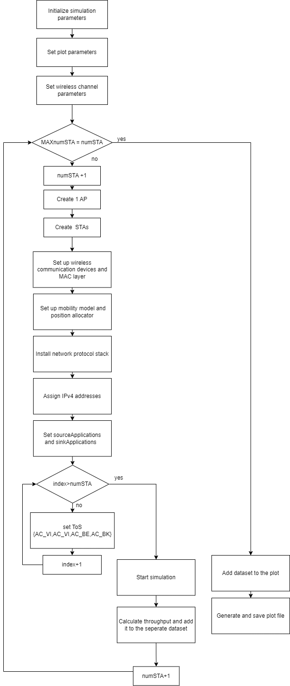

# Assignment 3 Studynote
## About ns-3
ns-3 is a discrete-event network simulator for Internet systems, targeted primarily for research and educational use. It is free, open-source software, licensed under the GNU GPLv2 license.
## Scenerio
Based on the paper "ANALYSIS OF IEEE 802.11E FOR QOS SUPPORT IN WIRELESS LANS", I improved the code from my assignment 2, which with 1 AP and increasing number of STA. The main diffferent is ToS (Type of Service) form only 1 {AC_BE change} to 4 {AC_BE, AC_BK, AC_VI, AC_VO}. 


 ▲ reference scenerio

### Parameter
| NAME | VALUE | 
| -------- | -------- | 
| WIFI     | 802.11n     |
|Band Width|40MHz|
| Modulation| OFDM  4.5 Mbps |
|Channel Model|YansWifiChannel|
|Number of AP|1|
|Max Number of STA|6|
|RTS|Yes|
|Hidden Node|NO|


## Flowchart & Code


This code is based on ns3-3.39/examples/wireless/wifi-simple-ht-hidden-stations.cc and wifi-multi-tos.cc. It includes the addition of a new feature to increase the number of stations (STAs), draw plots, and make some detailed modifications.

```c++ linenos
// This example considers two hidden stations in an 802.11n network which supports MPDU aggregation.
// The user can specify whether RTS/CTS is used and can set the number of aggregated MPDUs.
//
// Example: ./ns3 run "wifi-simple-ht-hidden-stations --enableRts=1 --nMpdus=8"
//
// Network topology:
//
//   Wifi 192.168.1.0
//
//        AP
//   *    *    *
//   |    |    |
//   n1   n2   n3
//
// Packets in this simulation belong to BestEffort Access Class (AC_BE).

#include "ns3/boolean.h"
#include "ns3/command-line.h"
#include "ns3/config.h"
#include "ns3/double.h"
#include "ns3/internet-stack-helper.h"
#include "ns3/ipv4-address-helper.h"
#include "ns3/log.h"
#include "ns3/mobility-helper.h"
#include "ns3/ssid.h"
#include "ns3/string.h"
#include "ns3/udp-client-server-helper.h"
#include "ns3/uinteger.h"
#include "ns3/yans-wifi-channel.h"
#include "ns3/yans-wifi-helper.h"
#include "ns3/gnuplot.h"
#include "ns3/core-module.h"
#include "ns3/sta-wifi-mac.h"
#include "ns3/on-off-helper.h"

#include "ns3/packet-sink-helper.h"
#include "ns3/packet-sink.h"

#include <cmath>
#include <set>

using namespace ns3;

NS_LOG_COMPONENT_DEFINE("SimplesHtHiddenStations");

int main(int argc, char* argv[])
{
    bool enableRts = true;
    uint32_t payloadSize = 1472; // bytes
    double simulationTime = 10;  // seconds
    double minExpectedThroughput = 0;
    double maxExpectedThroughput = 0;
    uint32_t numStations = 6;
    
    //Plot Setting
    std::string fileNameWithNoExtension = "plot";
    std::string graphicsFileName = fileNameWithNoExtension + ".png";
    std::string plotFileName = fileNameWithNoExtension + ".plt";
    std::string plotTitle = "Throughput vs Number of Stations";
    std::string dataTitle = "Aggregated Throughput";
    bool draw_ac = true;
    
    // Instantiate the plot and set its title.
    Gnuplot plot(graphicsFileName);
    plot.SetTitle(plotTitle);

    // Make the graphics file, which the plot file will create when it
    // is used with Gnuplot, be a PNG file.
    plot.SetTerminal("png");

    // Set the labels for each axis.
    plot.SetLegend("Number of Stations", "Throughput (Mbps)");

    // Set the range for the x axis.
    plot.AppendExtra("set xrange [1:" + std::to_string(numStations) + "]");
    plot.AppendExtra("set xtics 1");
    plot.AppendExtra("set yrange [0:20]");
    
    // Instantiate the datasets
    Gnuplot2dDataset dataset;
    dataset.SetTitle(dataTitle);
    dataset.SetStyle(Gnuplot2dDataset::LINES_POINTS);

    Gnuplot2dDataset datasetBE;
    datasetBE.SetTitle("AC BE");
    datasetBE.SetStyle(Gnuplot2dDataset::LINES_POINTS);

    Gnuplot2dDataset datasetBK;
    datasetBK.SetTitle("AC BK");
    datasetBK.SetStyle(Gnuplot2dDataset::LINES_POINTS);

    Gnuplot2dDataset datasetVI;
    datasetVI.SetTitle("AC VI");
    datasetVI.SetStyle(Gnuplot2dDataset::LINES_POINTS);

    Gnuplot2dDataset datasetVO;
    datasetVO.SetTitle("AC VO");
    datasetVO.SetStyle(Gnuplot2dDataset::LINES_POINTS);

    CommandLine cmd(__FILE__);
    cmd.AddValue("payloadSize", "Payload size in bytes", payloadSize);
    cmd.AddValue("enableRts", "Enable RTS/CTS", enableRts);
    cmd.AddValue("simulationTime", "Simulation time in seconds", simulationTime);
    cmd.AddValue("minExpectedThroughput",
                 "if set, simulation fails if the lowest throughput is below this value",
                 minExpectedThroughput);
    cmd.AddValue("maxExpectedThroughput",
                 "if set, simulation fails if the highest throughput is above this value",
                 maxExpectedThroughput);
    cmd.Parse(argc, argv);

    if (!enableRts)
    {
        Config::SetDefault("ns3::WifiRemoteStationManager::RtsCtsThreshold", StringValue("999999"));
    }
    else
    {
        Config::SetDefault("ns3::WifiRemoteStationManager::RtsCtsThreshold", StringValue("0"));
    }


    // Set the maximum wireless range to 5 meters in order to reproduce a hidden nodes scenario,
    // i.e. the distance between hidden stations is larger than 5 meters
    Config::SetDefault("ns3::RangePropagationLossModel::MaxRange", DoubleValue(999));

    for (uint32_t i = 1; i < numStations + 1; ++i) {
        NodeContainer wifiStaNodes;
        wifiStaNodes.Create(i);
        NodeContainer wifiApNode;
        wifiApNode.Create(1);

        YansWifiChannelHelper channel = YansWifiChannelHelper::Default();
        channel.AddPropagationLoss("ns3::RangePropagationLossModel");

        YansWifiPhyHelper phy;
        phy.SetPcapDataLinkType(WifiPhyHelper::DLT_IEEE802_11_RADIO);
        phy.SetChannel(channel.Create());
        phy.Set("ChannelSettings", StringValue("{0, 40, BAND_5GHZ, 0}"));

        WifiHelper wifi;
        wifi.SetStandard(WIFI_STANDARD_80211n);
        wifi.SetRemoteStationManager("ns3::ConstantRateWifiManager",
                                     "DataMode",
                                     StringValue("OfdmRate4_5MbpsBW5MHz"));
        WifiMacHelper mac;

        Ssid ssid = Ssid("ns3-80211n");
        mac.SetType("ns3::StaWifiMac", "Ssid", SsidValue(ssid));

        NetDeviceContainer staDevices;
        staDevices = wifi.Install(phy, mac, wifiStaNodes);

        mac.SetType("ns3::ApWifiMac",
                    "Ssid",
                    SsidValue(ssid),
                    "EnableBeaconJitter",
                    BooleanValue(false));

        NetDeviceContainer apDevice;
        apDevice = wifi.Install(phy, mac, wifiApNode);


        // Setting mobility model
        MobilityHelper mobility;
        Ptr<ListPositionAllocator> positionAlloc = CreateObject<ListPositionAllocator>();

        double AP_x = 10.0;
        double AP_y = 10.0;
        double radius = 4.99;
        positionAlloc->Add(Vector(AP_x, AP_y, 0.01234));

        uint32_t seed = 1;
        RngSeedManager::SetSeed(seed);
        Ptr<UniformRandomVariable> rand = CreateObject<UniformRandomVariable>();
        double max = 2 * M_PI;
        std::set<uint32_t> generatedNumbers;

        for (uint32_t j = 0; j < i; ++j) {
            double angle;
            do {
                angle = rand->GetValue(0, max);
            } while (generatedNumbers.count(angle) > 0);

            generatedNumbers.insert(angle);
            double STA_x = AP_x + radius * std::cos(angle);
            double STA_y = AP_y + radius * std::sin(angle);
            positionAlloc->Add(Vector(STA_x, STA_y, 0.0));
        }

        mobility.SetPositionAllocator(positionAlloc);
        mobility.SetMobilityModel("ns3::ConstantPositionMobilityModel");
        mobility.Install(wifiApNode);
        mobility.Install(wifiStaNodes);

        // Internet stack
        InternetStackHelper stack;
        stack.Install(wifiApNode);
        stack.Install(wifiStaNodes);

        Ipv4AddressHelper address;
        address.SetBase("192.168.1.0", "255.255.255.0");
        Ipv4InterfaceContainer staInterface;
        Ipv4InterfaceContainer apNodeInterface;

        staInterface = address.Assign(staDevices);
        apNodeInterface = address.Assign(apDevice);

        // Setting applications
        uint16_t port = 9;
        UdpServerHelper server(port);
        ApplicationContainer sourceApplications;
        ApplicationContainer sinkApplications;
        std::vector<uint8_t> tosValues = {0x70, 0x28, 0xb8, 0xc0}; // AC_BE, AC_BK, AC_VI, AC_VO
        double AC_totalth[4] = {0};

        for (uint32_t index = 0; index < i; ++index) {
            for (uint8_t tosValue : tosValues) {
                auto ipv4 = wifiApNode.Get(0)->GetObject<Ipv4>();
                const auto address = ipv4->GetAddress(1, 0).GetLocal();
                InetSocketAddress sinkSocket(address, port++);
                sinkSocket.SetTos(tosValue);
                OnOffHelper onOffHelper("ns3::UdpSocketFactory", sinkSocket);
                onOffHelper.SetAttribute("OnTime", StringValue("ns3::ConstantRandomVariable[Constant=1]"));
                onOffHelper.SetAttribute("OffTime", StringValue("ns3::ConstantRandomVariable[Constant=0]"));
                onOffHelper.SetAttribute("DataRate", DataRateValue(50000000 / i));
                onOffHelper.SetAttribute("PacketSize", UintegerValue(1472));
                sourceApplications.Add(onOffHelper.Install(wifiStaNodes.Get(index)));
                PacketSinkHelper packetSinkHelper("ns3::UdpSocketFactory", sinkSocket);
                sinkApplications.Add(packetSinkHelper.Install(wifiApNode.Get(0)));
            }
        }

        sinkApplications.Start(Seconds(0.0));
        sinkApplications.Stop(Seconds(simulationTime + 1));
        sourceApplications.Start(Seconds(1.0));
        sourceApplications.Stop(Seconds(simulationTime + 1));

        Simulator::Stop(Seconds(simulationTime + 1));
        Simulator::Run();

        double throughput = 0;
        for (uint32_t index = 0; index < sinkApplications.GetN(); ++index) {
            uint64_t totalPacketsThrough = DynamicCast<PacketSink>(sinkApplications.Get(index))->GetTotalRx();
            double ac_throughput = ((totalPacketsThrough * 8) / (simulationTime * 1000000.0));
            uint16_t AC_type = index % 4;
            AC_totalth[AC_type] += ac_throughput;
            throughput += ac_throughput;
        }

        if (throughput > 0) {
            dataset.Add(i, throughput);
            if (draw_ac) {
                datasetBE.Add(i, AC_totalth[0]);
                datasetBK.Add(i, AC_totalth[1]);
                datasetVI.Add(i, AC_totalth[2]);
                datasetVO.Add(i, AC_totalth[3]);
            }
        } else {
            NS_LOG_ERROR("Obtained throughput is 0!");
        }

        Simulator::Destroy();
    }

    // Add the datasets to the plot
    plot.AddDataset(dataset);
    if (draw_ac) {
        plot.AddDataset(datasetBE);
        plot.AddDataset(datasetBK);
        plot.AddDataset(datasetVI);
        plot.AddDataset(datasetVO);
    }

    // Open the plot file
    std::ofstream plotFile(plotFileName.c_str());

    // Write the plot file
    plot.GenerateOutput(plotFile);

    // Close the plot file
    plotFile.close();

    return 0;
}


```
### Compile
```bash
cd workspace/ns-3-allinone/ns-3.39/
./ns3 run [filename]

//after finish compile
//create plot.png from .plt
gnuplot plot.plt
```


## Result

In above plot, the order of ToS is correct. , but the trend doesn't go up until reach the highpoint. Both AC_BE and AC_BK throughput is very small, at the bottom which hard to see as two seperate lines.

## Future Work
The throughput won't increase with the STA number, which should. Still need to find which parameter caused the problem

Also, since the ToS I use can not set detail parameter same as the reference paper, this might one reason the result is not identicel.
