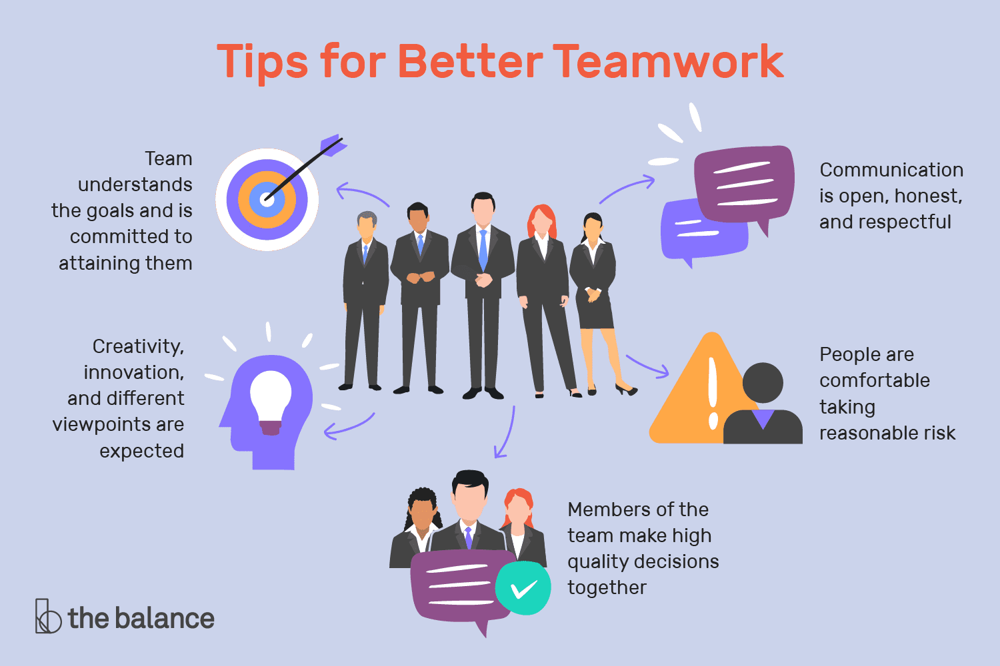

# 
Study Note for Interpersonal Skills 

reference:
- 5-Minute Presentation ([[1]](https://www.liveabout.com/mastering-the-art-of-the-5-minute-presentation-2951697),[[2]](https://www.youtube.com/watch?v=YVgS_opYacQ))
- [How to Read a Paper](https://www.eecs.harvard.edu/~michaelm/postscripts/ReadPaper.pdf)
- [How to Write a Report](https://www.openpolytechnic.ac.nz/current-students/study-tips-and-techniques/assignments/assignment-types/)
- [10 Tips for Better Teamwork](https://www.liveabout.com/tips-for-better-teamwork-1919225)

## 1. For 5-Minute Presentation

abstract
> I believe the key to a 5-minute short presentation lies in how to ==grab the audience's attention and keep them focused in a short amount of time.== Therefore, the content of the presentation must highlight the most essential points. The speaker needs to articulate the content coherently, exhibit personal charisma with composure on stage, and attract the audience's gaze. I believe that by achieving these aspects, you can keep the audience attentively listening to your presentation. 

>Thus, based on the article "[Mastering the Art of the Five-Minute Presentation](https://www.liveabout.com/mastering-the-art-of-the-5-minute-presentation-2951697)" and the video "[5 Tips in 5 Minutes - Presentations](https://www.youtube.com/watch?v=YVgS_opYacQ)," I have divided the key points into the following **three parts**:

### I. Choose one important concept
1.  Even though you only have 5 minutes, do thorough **research** before your talk. Keep things short and **focus on the most important concept**.
2. Start your presentation by **getting straight to the point**, telling a **story** to help explain things. 
3. **Avoid using too many statistics and numbers**, and make sure they connect well with your story.
### II. Keep slide simple
1. **Keep your slides simple**. Use **one font** style, and try to put only **a few words** on each slide to share the main ideas. 
2. Pick presentation templates with **2-3 colors in basic color blocks**. 
3. Use **beautiful pictures** and **simple data**. Put pictures in focal point to highlight key points, and make sure any data is easy to read and shows the main ideas.

	

### III. Practice over and over again
1. Practice multiple times before your talk, and **don't just read from your slides**. 
2. Practice in front of a mirror, **focusing on your tone, inflections, and body language**. 
3. **Display ample confidence** to captivate the audience and leave memorable impressions regarding the presentation content.
---

## 2. For Read a Paper
abstract
>When deciding whether to delve into a research paper, it's essential to quickly *skim* through it and attempt to summarize its key points in one or two sentences. This helps determine if the paper is relevant to your research field or report. 

>If a more in-depth reading is required, the article "[How to Read a Research Paper](https://www.eecs.harvard.edu/~michaelm/postscripts/ReadPaper.pdf)" offers methods and suggestions, summarized in the following **three key points**:

### I. Maintain critical reading
1. **Don't** assume that the research methods and data in the paper **are entirely correct**.
2. **Question** whether the author's research methods or problem definition are appropriate. Are there any limitations not explicitly mentioned by the author?
### II. Find the Paper's Strengths
1. Identify the effective methods proposed in the paper and check if these methods have been suggested in other fields or applications.
2. Explore opportunities to optimize the presented research.
### III. Make notes
1. Record any lingering doubts or questions after reading the paper to avoid forgetting them later. **Underline key points** deemed essential in the paper.
2. **Summarize the main points of the paper in one or two sentences**. If this is easily achievable, attempt to consolidate more important subpoints of the main ideas.
3. **Compare the paper's contributions with other works** to confirm its significance.

---
## 3. For Write a Report
abstract
> Whether it's an essay, presentation, quizzes, or report, each has a specific writing structure. The "[assessment type](https://www.openpolytechnic.ac.nz/current-students/study-tips-and-techniques/assignments/assignment-types/)" article provides different writing types and their respective formats and structures to pay attention to. Here are some types:

### Essays
- **Introduction**: States the topic, approach, and what will be covered.
- **Body**: Introduces main points, explains them, and provides supporting evidence.
- **Conclusion**: Restates the topic, summarizes main points, and may include recommendations.
### Presentation 
- Presentation needs an **introduction**, **body**, and **conclusion**, similar to an essay but with key information only.
- **Information presentation methods**: Bullet points, quotes, pictures, charts, and diagrams.
### Quizzes
- **Question types**: Multiple choice, short answer, fill in the blanks, extended response, and essay style.
- Ensure responses cover key points.
### Reports
- Presents investigation and analysis with recommendations and proposals.
- Structure includes title page, executive summary, contents page, introduction, terms of reference, procedure, findings, conclusions, recommendations, references/bibliography, and appendices.
- Details may vary based on the type of report (research report, building report, laboratory report).
### Other Assessment Types
- **Annotated Bibliography**: Lists resources with brief summaries and evaluations.
- **Case Study**: Describes real situations, events, or detailed information about a person, group, or situation.
- **Reflective Writing**: Focuses on insights gained from learning experiences.
- **Review/Literature Review or Summary**: Evaluates the purpose and summarizes/synthesizes arguments and ideas without adding new ideas.

---
## 4. For Better Teamwork
abstract
>Good teamwork requires the collective effort of all team members, and I believe that in a good team, both work efficiency and the working atmosphere can be significantly enhanced. In the article "[10 Tips for Better Teamwork](https://www.liveabout.com/tips-for-better-teamwork-1919225)," 10 techniques are mentioned for improving team dynamics. I have summarized these tips into the following five important aspects:

### I. Clear Mission and Goals
- The team understands and is committed to its mission and goals.
- Clear direction and agreement on purpose are essential for effective teamwork.
### II. Encouragement of Reasonable Risks
- The team fosters an environment where members are comfortable taking reasonable risks in communication and actions.
- Trust is a crucial element; members are not penalized for disagreements but rather encouraged for diverse perspectives.
### III. Respectful Communication
- Communication is open, honest, and respectful.
- Team members feel free to express thoughts, opinions, and potential solutions.
- Deep listening and understanding are emphasized, promoting a positive communication culture.
### IV. Strong Group Commitment
- Team members have a deep sense of belonging to the group.
- Commitment to group decisions and actions is reinforced through the development of team norms and relationship guidelines.
### V. Continuous Improvement and Problem Solving
- The team engages in continuous self-examination and improvement of processes and practices.
- It practices participative leadership, with agreed-upon procedures for diagnosing and resolving teamwork problems.
- Regular review meetings assess the team's progress and alignment with its mission.

	

