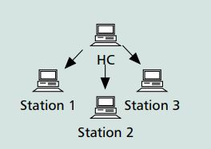

#  Study Note: IEEE 802.11e QoS Analysis

 Desalegn Aweke Wako
- [Study Note: IEEE 802.11e QoS Analysis](#study-note-ieee-80211e-qos-analysis)
  - [1. Introduction](#1-introduction)
  - [2. Assumptions](#2-assumptions)
  - [3. Experimental Set up](#3-experimental-set-up)
  - [4. Results and  Analysis](#4-results-and-analysis)
    - [4.1 Throughput Trends](#41-throughput-trends)
    - [4.2 Discussion](#42-discussion)
  - [5. Conclusions](#5-conclusions)
  - [References](#references)

## 1. Introduction
IEEE 802.11e defines Enhanced Distributed Channel Access (EDCA) and Hybrid Coordination Function (HCF) to provide QoS mechanisms. The Qos features of the IEEE 802.11e MAC layer protocol is implemented using the NS-3 simulator. EDCA use parameters for different Access Categories (ACs) to ensure prioritized traffic handling.

In EDCA, packets are classified into four access categories, each category having a different priority.  These are

    * Voice
    * Video
    * Best effort
    * Background

## 2. Assumptions
The following assumptions are used for simulation

    * MAC Protocol: IEEE 802.11e
    * PHY Protocol: IEEE 802.11a
    * Control Frame Rate: 6 Mbps
    * Data Frame Rate: 24 Mbps
    * Traffic Load: 250 kbps per stream
    * Network Topology: 1 HC (Access Point) and 3 STAs (Stations)
    * Traffic Pattern: 1 stream per AC from HC to each STA

## 3. Experimental Set up
 To simulate Qos parameters, we have installed the the following  on windows OS. 

		*	virtual machine to install the simultor
		*	ubuntu 20.04
		*	NS-3.38*
- **Network Topology**

 we have used the network topology consisting of one access point (HC) and three stations (STAs) as shown in [1]. The HC served as the central node, while the STAs represented the client devices.

In this simulation, the HC transmits four distinct streams to each of the three stations, with each stream being assigned a specific priority level.
 
- **Simulation Parameter**
Standard: IEEE 802.11a
  - Channel Model: YansWifiChannel
  - Physical Layer: OFDM with data rate 24 Mbps and control rate 6 Mbps
  - EDCA Parameters: Configured for each access category (VO, VI, BE, BK)

 Based on the article [1] and existing literature,the following EDCA parameters are used for the simulation. We configured the EDCA parameters for each access category as indicated in the table

| Access Category(AC)| AIFSN | CWmin |CWmax |
|----------          |-------|-------|------|
| AC_VO              | 2     |3      |7
| AC_VI              | 2     | 7     |15
| AC_BE              | 3     | 15    |1023
| AC_BK              | 7     | 15    |1023

- **Traffic Generation**
  - The traffic was generated through OnOff applications utilizing UDP sockets. HC transmitted data to the Stations (STAs) at a consistent data rate of 250 kbps.

## 4. Results and  Analysis

Based on the graph you’ve provided, here’s an estimation of the numerical results:
### 4.1 Throughput Trends

Based on the results generated from the NS3 simulation, the following observations have been noted.
- **AC_VO (Voice):**
    Throughput increases linearly up to 9 Mb/s of offered traffic, reaching a maximum of 12 Mb/s. Beyond 9 Mb/s, the throughput stabilizes at 12 Mb/s, indicating the saturation point for voice traffic.

- **AC_VI (Video):** Throughput increases steadily up to 9 Mb/s of offered traffic, peaking at 9 Mb/s. After 9 Mb/s, throughput gradually declines, showing a reduction in performance due to increased traffic load.
  
- **AC_BE (Best Effort):** Throughput increases up to 9 Mb/s of offered traffic, peaking at 7 Mb/s. Beyond this point, throughput declines sharply, indicating a significant drop in performance under high traffic conditions.

- **AC_BK (Background):** Throughput follows a similar pattern to AC_BE, peaking at 5 Mb/s for 9 Mb/s of offered traffic.
A sharp decline in throughput is observed beyond this traffic load. 

The relationship between offered traffic and throughput for each access category is visualized in the following plot

### 4.2 Discussion

- The stability of AC_VO  at higher traffic loads reflects robust QoS mechanisms ensuring low latency and high priority.
- AC_VI, peaks at 9 Mb/s and then declines, indicating some QoS guarantees but less strict than AC_VO.
- As shown in the plot above, AC_BE and AC_BK performance drops under high traffic loads highlight the impact of lower QoS prioritization, making them unsuitable for time-sensitive applications
  
Ingeneral, the implication of  QOS in the network design are significant
  - Prioritization: Ensuring high-priority traffic (voice and video) receives sufficient bandwidth and low latency is crucial for maintaining service quality.
  - Resource Allocation: Allocating resources dynamically based on traffic type and load can optimize network performance and meet QoS requirements.
  - Traffic Management: Implementing advanced QoS mechanisms for video traffic can help maintain performance under varying load conditions.

## 5. Conclusions

The analysis of throughput versus offered traffic for various access categories demonstrates the critical role of QoS in maintaining network performance. AC_VO and AC_VI benefit from higher QoS prioritization, ensuring reliable performance for voice and video applications. 

Conversely, AC_BE and AC_BK experience significant performance degradation under high traffic loads, reflecting their lower QoS priority. These insights are essential for network design and traffic management strategies to ensure efficient and reliable communication services.

## References
 1. [S. Mangold, Sunghyun Choi, G. R. Hiertz, O. Klein and B. Walke, "Analysis of IEEE 802.11e for QoS support in wireless LANs," in IEEE Wireless Communications, vol. 10, no. 6, pp. 40-50,2003](https://ieeexplore.ieee.org/document/1265851)
 2. [NS-3 Simulator](https://www.nsnam.org/docs/manual/html/events.html)
 2. [Wifi Models](https://www.nsnam.org/docs/release/3.8/doxygen/group___wifi.html)
 3. [Wifi Design](https://github.com/imec-idlab/IEEE-802.11ah-ns-3/blob/master/src/wifi/doc/source/wifi-design.rst)
