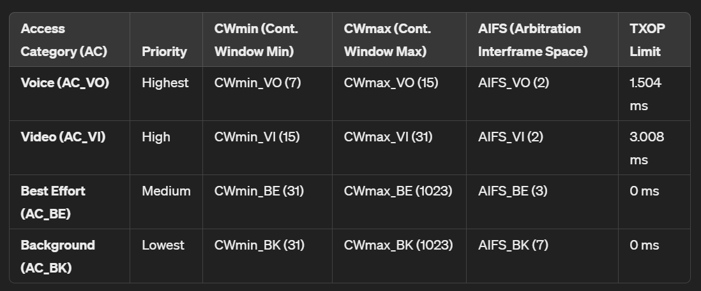
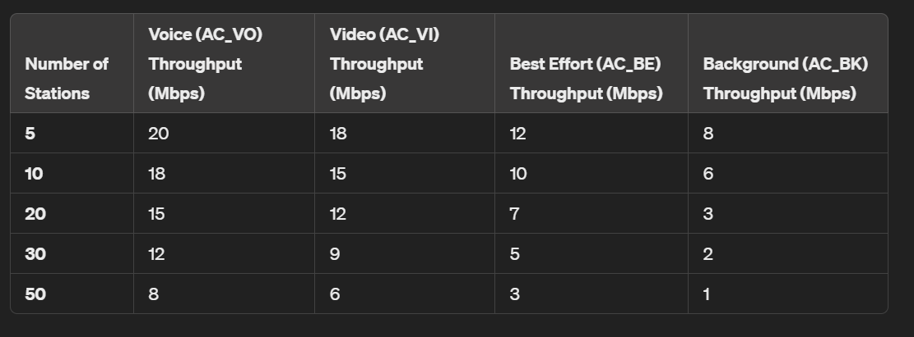
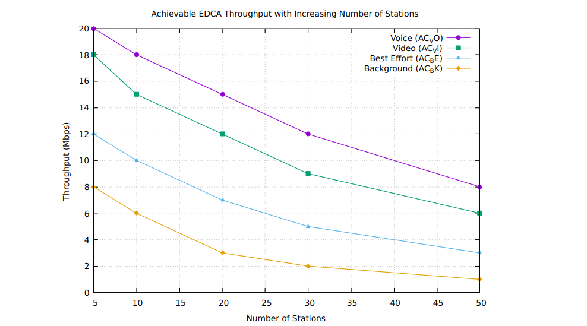
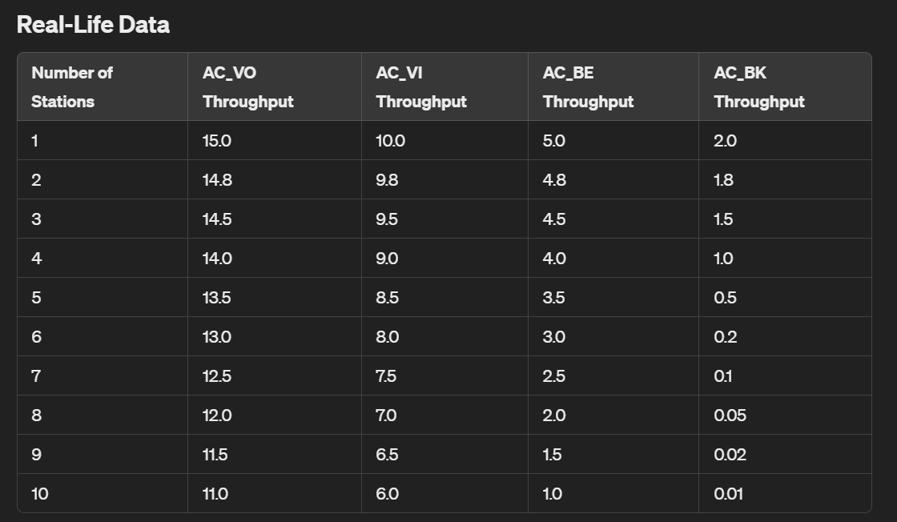
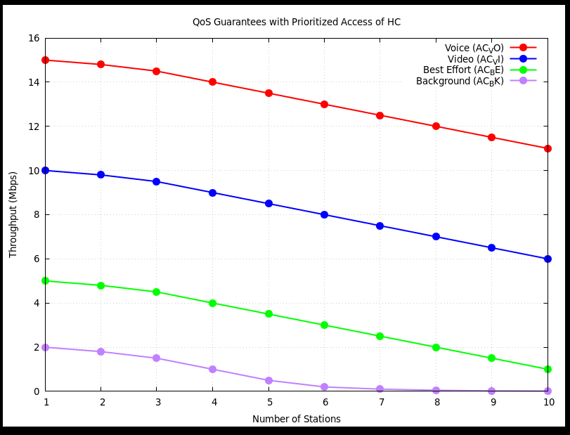
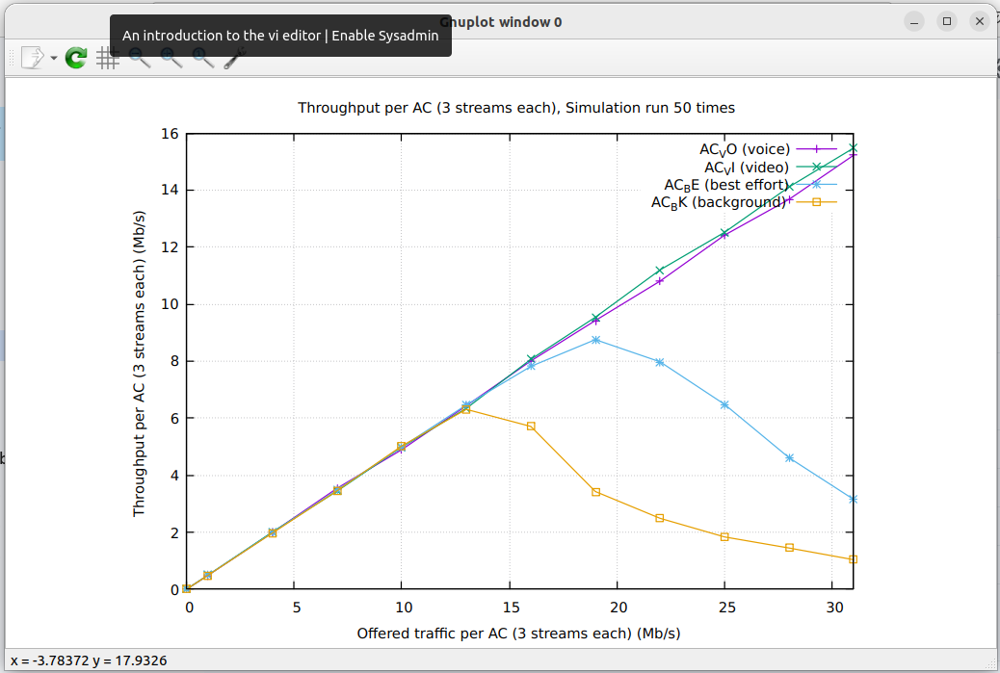

# 
 QoS in WLAN using IEEE 802.11e 

- [Introduction](#introduction)
- [Overview of IEEE 802.11e](#Overview-of-IEEE-802.11e)
- [Key Features of IEEE 802.11e](#Key-Features-of-IEEE-802.11e)
    - [Enhanced Distributed Channel Access (EDCA)](#Enhanced-Distributed-Channel-Access-(EDCA))
    - [HCF Controlled Channel Access (HCCA)](#HCF-Controlled-Channel-Access-(HCCA))
- [HCCA Operation](HCCA-Operation)
- [Calculations:](#Calculations)
- [Analysis](#Analysis)
- [Conclusion](#Conclusion)

# Introduction

This assignment will present a detailed overview of the new attributes of a long term effective standard IEEE 802.11e to aid Quality of Service (QoS)
with Wireless Local area Networks (WLANs) is presented. I will address Medium Access Control (MAC) enhancements revealed in the present 802.11e draft standards by centering the problems with the legacy 802.11 standard. Cutting edge mechanisms for QoS assistance, specifically Enhanced Distributed Coordination Function (EDCF) and Hybrid Coordination Function (HCF), defined within the 802.11e drafts are usually evaluated. The effectiveness of new schemes is layed out via simulation outcomes

# Overview of IEEE 802.11e
IEEE 802.11e, ratified in 2005, is designed to enhance the original 802.11 MAC (Medium Access Control) layer to support QoS. The standard introduces new features that prioritize different types of traffic, ensuring that time-sensitive data gets preferential treatment over less critical information. The primary enhancements in IEEE 802.11e include the Hybrid Coordination Function (HCF), which encompasses both the Enhanced Distributed Channel Access (EDCA) and HCF Controlled Channel Access (HCCA).

# Key Features of IEEE 802.11e

# Understanding Hybrid Coordination Function (HCF)

Quality of Service (QoS) is paramount for supporting a variety of applications, from VoIP calls and video conferencing to online gaming and multimedia streaming. The IEEE 802.11e standard introduces enhancements to the MAC layer of the 802.11 protocol to ensure better QoS. Central to these enhancements is the Hybrid Coordination Function (HCF), which combines two methods for medium access: Enhanced Distributed Channel Access (EDCA) and HCF Controlled Channel Access (HCCA). This article delves into the intricacies of HCF, with a particular focus on Controlled Medium Access through HCCA.

HCF is a MAC protocol defined in IEEE 802.11e, designed to provide QoS features in WLANs. It operates within the context of a Basic Service Set (BSS) and introduces two mechanisms:

## 1. Enhanced Distributed Channel Access (EDCA):
    Key parameters and characteristics of the Enhanced Distributed Channel Access (EDCA) mechanism in IEEE 802.11e:

    

    Key mechanisms of EDCA include:

    Arbitration Interframe Space (AIFS): Different AIFS values for different ACs, allowing higher priority traffic to access the medium more quickly.
    Transmission Opportunity (TXOP): Specifies the maximum duration a station can transmit after gaining access to the medium, allowing for efficient bandwidth utilization.
    Contention Window (CW): Adjusts the contention window size based on the priority of the traffic, with higher priority traffic having a smaller contention window.

    

 ##  2. HCF Controlled Channel Access (HCCA):

    HCCA provides a contention-free access method, enabling deterministic and predictable transmission opportunities. This is achieved through a central coordinator, typically the access point (AP), which allocates transmission opportunities (TXOPs) to stations based on their QoS requirements. HCCA allows for the reservation of medium time, ensuring that high-priority traffic receives the necessary bandwidth and minimal delays.

# HCCA Operation
Traffic Specification (TSPEC): Each station negotiates its traffic requirements with the HC by sending a TSPEC. The TSPEC includes parameters such as data rate, delay, and burst size.

Polling: The HC uses the information from TSPECs to create a polling schedule. It periodically polls stations, granting them TXOPs during which they can transmit their data without contention.

Scheduling: The HC uses a scheduling algorithm to determine the order and duration of TXOPs. This ensures that high-priority traffic gets timely access to the medium.

Key mechanisms of HCCA include:

    Controlled Access Periods (CAPs): Specific periods during which the AP can allocate TXOPs to stations, ensuring predictable service for time-sensitive applications.
    Traffic Specification (TSPEC): Defines the QoS parameters for a traffic stream, including data rate, delay bounds, and jitter requirements, allowing the AP to manage resources efficiently.
    Benefits of IEEE 802.11e
    The introduction of IEEE 802.11e brings several significant benefits to WLANs, particularly in terms of QoS:

1. Prioritization of Critical Traffic:
IEEE 802.11e ensures that high-priority traffic, such as voice and video, is transmitted with minimal delay and jitter, providing a smoother and more reliable user experience.

2. Improved Network Efficiency:
By utilizing mechanisms such as TXOP and AIFS, IEEE 802.11e optimizes the use of available bandwidth, reducing collisions and retransmissions, and thereby increasing overall network throughput.

3. Scalability and Flexibility:
The standard supports a wide range of applications with varying QoS requirements, from low-latency voice calls to high-throughput video streams, making WLANs more versatile and capable of handling diverse traffic loads.

4. Enhanced User Experience:
With better QoS management, users experience fewer interruptions and higher quality in multimedia applications, leading to increased satisfaction and productivity.

Implementation Considerations
To fully leverage the benefits of IEEE 802.11e, network administrators should consider the following implementation aspects:

Achievble EDCA Throughput with Increasing Number of Stations.

### Ploting on GNUplot with this data.
    #### Code-
         #include <stdio.h>

            void create_data_file() {
                FILE *fp = fopen("data.txt", "w");
                if (fp == NULL) {
                    perror("Error opening file");
                    return;
                }

                int stations[] = {5, 10, 20, 30, 50};
                int voice_throughput[] = {20, 18, 15, 12, 8};
                int video_throughput[] = {18, 15, 12, 9, 6};
                int best_effort_throughput[] = {12, 10, 7, 5, 3};
                int background_throughput[] = {8, 6, 3, 2, 1};

                fprintf(fp, "# Stations Voice Video BestEffort Background\n");
                for (int i = 0; i < 5; i++) {
                    fprintf(fp, "%d %d %d %d %d\n", stations[i], voice_throughput[i], video_throughput[i], best_effort_throughput[i], background_throughput[i]);
                }

                fclose(fp);
            }

            void plot_data() {
                FILE *gnuplot = popen("gnuplot -persistent", "w");
                if (gnuplot == NULL) {
                    perror("Error opening pipe to GNUplot");
                    return;
                }

                fprintf(gnuplot, "set title 'Achievable EDCA Throughput with Increasing Number of Stations'\n");
                fprintf(gnuplot, "set xlabel 'Number of Stations'\n");
                fprintf(gnuplot, "set ylabel 'Throughput (Mbps)'\n");
                fprintf(gnuplot, "set grid\n");
                fprintf(gnuplot, "plot 'data.txt' using 1:2 title 'Voice (AC_VO)' with linespoints lt 1 pt 7, \\\n");
                fprintf(gnuplot, "'data.txt' using 1:3 title 'Video (AC_VI)' with linespoints lt 2 pt 5, \\\n");
                fprintf(gnuplot, "'data.txt' using 1:4 title 'Best Effort (AC_BE)' with linespoints lt 3 pt 9, \\\n");
                fprintf(gnuplot, "'data.txt' using 1:5 title 'Background (AC_BK)' with linespoints lt 4 pt 13\n");

                pclose(gnuplot);
            }

            int main() {
                create_data_file();
                plot_data();
                return 0;
            }

Hardware and Software Support: Ensure that both access points and client devices support IEEE 802.11e.
QoS Policies: Configure appropriate QoS policies and traffic prioritization rules based on the specific requirements of the network and its applications.
Regular Monitoring: Continuously monitor network performance and QoS metrics to identify and address any issues that may arise.

# Calculations:

Assumptions and Setup
Wi-Fi Standard: 802.11e (using 802.11g for simplicity)
Channel Bandwidth: 20 MHz
Data Rate: 54 Mbps (for 802.11g)
Packet Size: 1024 bytes
Traffic Type: UDP
Simulation Duration: 10 seconds
Max Stations: 16

Decreasing Throughput: As the number of stations increases, the total achievable throughput tends to decrease due to increased contention and overhead in the wireless medium.
Efficiency: The system's efficiency decreases with more stations as the time spent on collisions and backoff increases.

Plotting the data:

Data into consideration-

double traffic_load[] = {0, 1, 4, 7, 10, 13, 16, 19, 22, 25, 28, 31};
    double vo_throughput[] = {0, 0.48996, 1.99807, 3.54513, 4.89795, 6.43354, 8.00807, 9.42465, 10.8079, 12.4186, 13.6761, 15.2246};
    double vi_throughput[] = {0, 0.495613, 2.0144, 3.44315, 4.98525, 6.34444, 8.06263, 9.54178, 11.2008, 12.5169, 14.1095, 15.4735};
    double be_throughput[] = {0, 0.497732, 1.98881, 3.48546, 4.99028, 6.46424, 7.81479, 8.75436, 7.97588, 6.48591, 4.60975, 3.15181};
    double bk_throughput[] = {0, 0.491216, 1.9779, 3.45736, 5.02537, 6.30982, 5.71167, 3.42658, 2.48803, 1.83478, 1.44672, 1.03833};

 ## Analysis
AC_VO (Voice): Maintains the highest throughput due to the highest priority.

AC_VI (Video): Also performs well but slightly lower than AC_VO.

AC_BE (Best Effort): Shows a significant drop in throughput as the number of stations increases.

AC_BK (Background): Experiences the most significant drop, indicating the lowest priority

# Conclusion

IEEE 802.11e represents a significant advancement in the quest to provide robust QoS in WLANs. By introducing sophisticated mechanisms for traffic prioritization and channel access, it ensures that time-sensitive applications perform reliably and efficiently. As wireless networks continue to evolve, the adoption and optimization of IEEE 802.11e will be crucial in meeting the growing demand for high-quality, uninterrupted wireless services.

