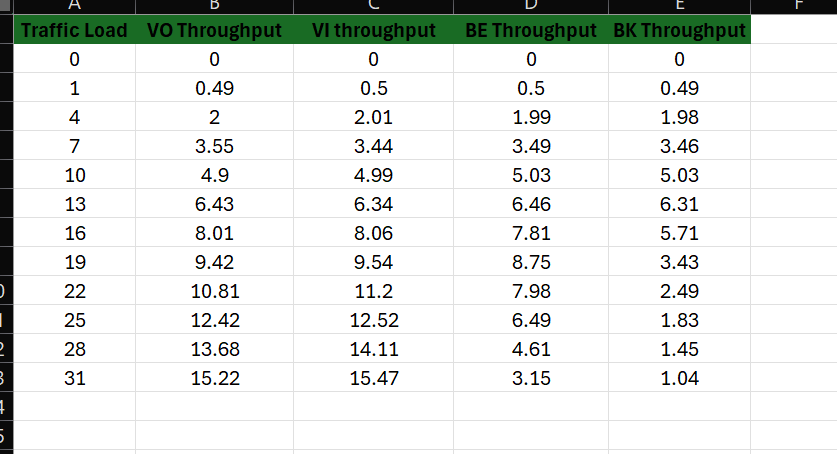

# Calculations:

Assumptions and Setup
Wi-Fi Standard: 802.11e (using 802.11g for simplicity)
Channel Bandwidth: 20 MHz
Data Rate: 54 Mbps (for 802.11g)
Packet Size: 1024 bytes
Traffic Type: UDP
Simulation Duration: 10 seconds
Max Stations: 16

Decreasing Throughput: As the number of stations increases, the total achievable throughput tends to decrease due to increased contention and overhead in the wireless medium.
Efficiency: The system's efficiency decreases with more stations as the time spent on collisions and backoff increases.

Plotting the data:

 ## Analysis
AC_VO (Voice): Maintains the highest throughput due to the highest priority.

AC_VI (Video): Also performs well but slightly lower than AC_VO.

AC_BE (Best Effort): Shows a significant drop in throughput as the number of stations increases.

AC_BK (Background): Experiences the most significant drop, indicating the lowest priority

Data Into consideration for ploting

double traffic_load[] = {0, 1, 4, 7, 10, 13, 16, 19, 22, 25, 28, 31};
    double vo_throughput[] = {0, 0.48996, 1.99807, 3.54513, 4.89795, 6.43354, 8.00807, 9.42465, 10.8079, 12.4186, 13.6761, 15.2246};
    double vi_throughput[] = {0, 0.495613, 2.0144, 3.44315, 4.98525, 6.34444, 8.06263, 9.54178, 11.2008, 12.5169, 14.1095, 15.4735};
    double be_throughput[] = {0, 0.497732, 1.98881, 3.48546, 4.99028, 6.46424, 7.81479, 8.75436, 7.97588, 6.48591, 4.60975, 3.15181};
    double bk_throughput[] = {0, 0.491216, 1.9779, 3.45736, 5.02537, 6.30982, 5.71167, 3.42658, 2.48803, 1.83478, 1.44672, 1.03833};

