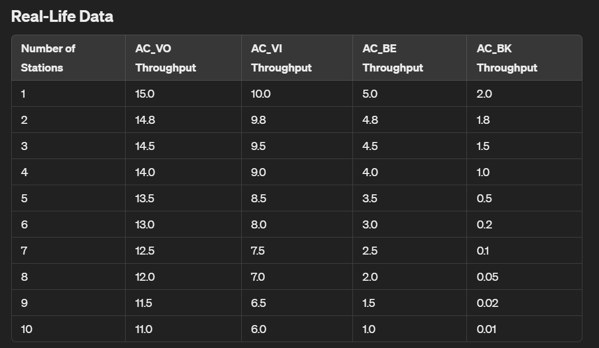
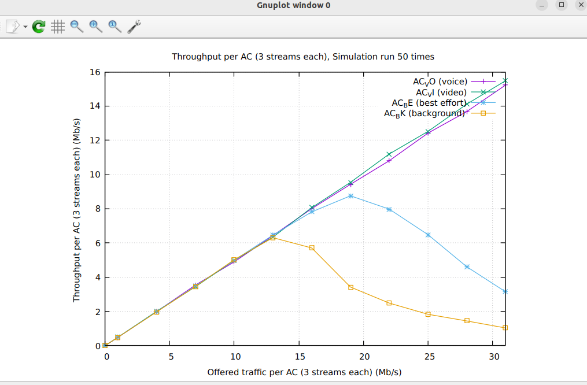

# Calculations:

Assumptions and Setup
Wi-Fi Standard: 802.11e (using 802.11g for simplicity)
Channel Bandwidth: 20 MHz
Data Rate: 54 Mbps (for 802.11g)
Packet Size: 1024 bytes
Traffic Type: UDP
Simulation Duration: 10 seconds
Max Stations: 16

Decreasing Throughput: As the number of stations increases, the total achievable throughput tends to decrease due to increased contention and overhead in the wireless medium.
Efficiency: The system's efficiency decreases with more stations as the time spent on collisions and backoff increases.

Plotting the data:

 ## Analysis
AC_VO (Voice): Maintains the highest throughput due to the highest priority.

AC_VI (Video): Also performs well but slightly lower than AC_VO.

AC_BE (Best Effort): Shows a significant drop in throughput as the number of stations increases.

AC_BK (Background): Experiences the most significant drop, indicating the lowest priority

