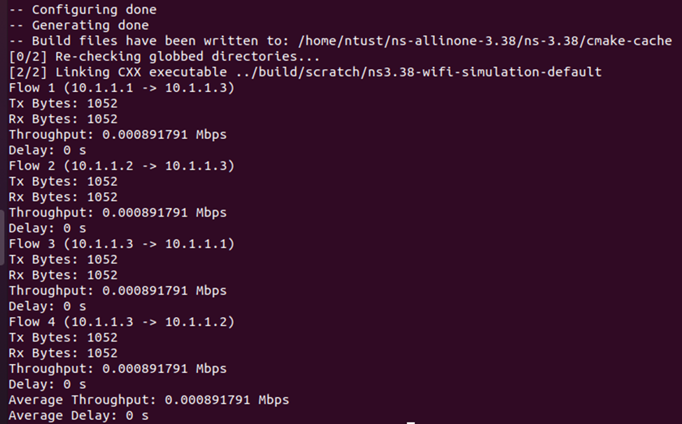
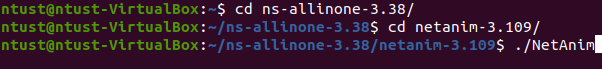
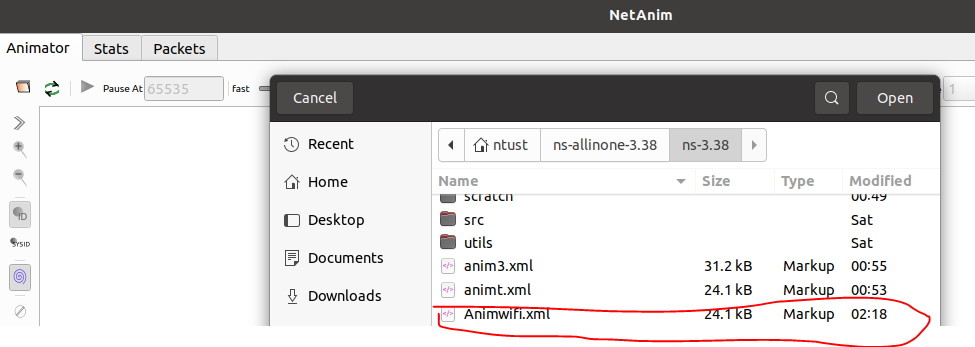
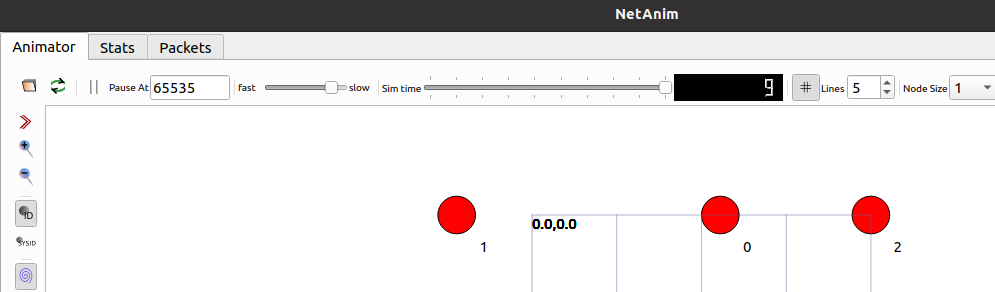
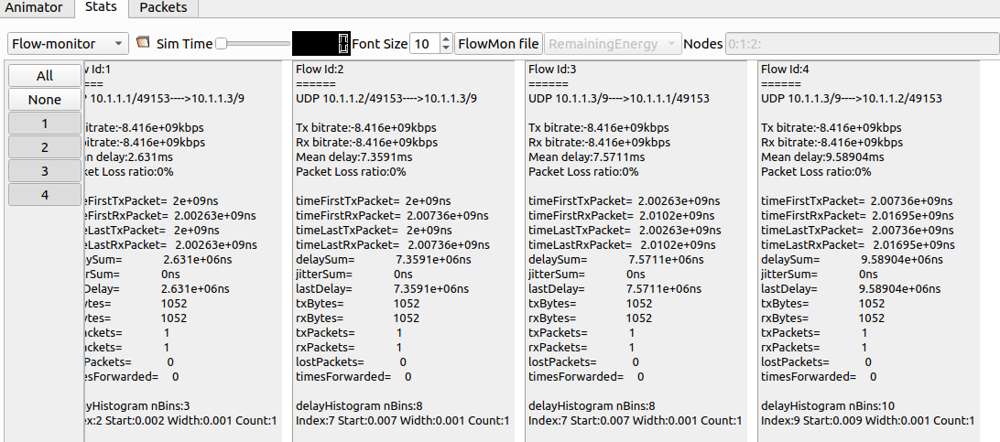
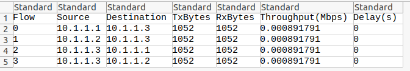
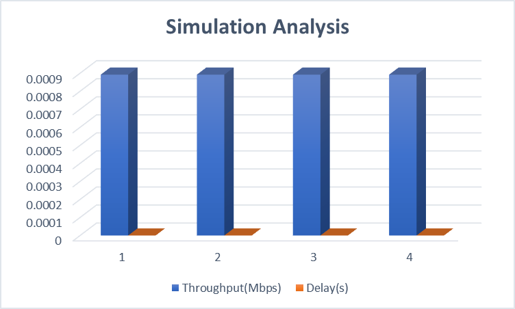

##  Numerical Results

- Run the simulation file **WifiSimulation.cc** on NS-3.38 simulator

- The  simulation is configured and dispaly the result as illustrated in the following image.

The statistics of four different flows in the network simulation is generated. A flow in this context refers to the stream of packets from a source node to a destination node.
After the simulation run, we observe the mobility of the node by using ./NetAnim feature.

- open XML tracer file and check the movement of nodes

- start to play

- open flow monitor to check the statistics

Based on the result of our simulation, the breakdown of each flow is stated as follows
- Flow 1 (10.1.1.1 -> 10.1.1.3): This flow is from the node with IP address 10.1.1.1 (Node A) to the node with IP address 10.1.1.3 (Node C). The transmitted (Tx) and received (Rx) bytes are both 1052 bytes, and the throughput is approximately 0.000891791 Mbps.
- Flow 2 (10.1.1.2 -> 10.1.1.3): This flow is from the node with IP address 10.1.1.2 (Node B) to the node with IP address 10.1.1.3 (Node C). The transmitted (Tx) and received (Rx) bytes are both 1052 bytes, and the throughput is approximately 0.000891791 Mbps.
- Flow 3 (10.1.1.3 -> 10.1.1.1): This flow is from the node with IP address 10.1.1.3 (Node C) to the node with IP address 10.1.1.1 (Node A). The transmitted (Tx) and received (Rx) bytes are both 1052 bytes, and the throughput is approximately 0.000891791 Mbps.
- Flow 4 (10.1.1.3 -> 10.1.1.2): This flow is from the node with IP address 10.1.1.3 (Node C) to the node with IP address 10.1.1.2 (Node B). The transmitted (Tx) and received (Rx) bytes are both 1052 bytes, and the throughput is approximately 0.000891791 Mbps.
- In all four flows, the number of transmitted bytes equals the number of received bytes, which suggests that there is no packet loss in the network. The throughput is the same for all flows, indicating that the network resources are evenly distributed among the flows.
- Lost packets are checked in the flow monitor to assess network performance.
- Flow statistics are analyzed to determine throughput and delay for each flow. Results are written to a CSV file for further examination and comparison.

The results stored in csv file  is checked in barchart graph to observe throughput versus delay

