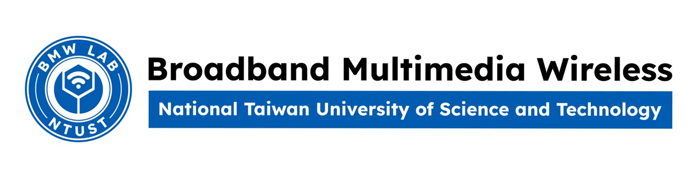

# 
 2024 Multimedia Wireless Networks (ET5907701) 

- [ 2024 Multimedia Wireless Networks (ET5907701) ](#-2024-multimedia-wireless-networks-et5907701-)
  - [Introduction](#introduction)
  - [1. Profile](#1-profile)
  - [2. Assignments:](#2-assignments)
    - [A1 (DL: 2024/03/05, 08.00 A.M.)](#a1-dl-20240305-0800-am)
    - [A2 (DL: 2024/04/09, 08.00 A.M.)](#a2-dl-20240409-0800-am)
    - [A3 (DL: 2024/05/14, 08.00 A.M.)](#a3-dl-20240514-0800-am)

## 1. Profile
1. Name: Emiliano Nazareno Rojas Marcelli
2. Student ID: F11215120
3. Department: Computer Science and Information Engineering
4. Student status: Exchange student

## 2. Assignments:

### A1 (DL: 2024/03/05, 08.00 A.M.)
- [Assignment Information](https://github.com/bmw-ece-ntust/multimedia-wireless-network?tab=readme-ov-file#a1-deadline-35-0800-am)
- Submissions:
  - [x] [Study Note](Assignment.md)
  - [x] [Video Presentation](https://youtu.be/8B9ZsdBQUH4) of your assignment explanation.
  - [x] [Peer Review](https://forms.gle/tPVAdfAc4hBiUtg88)

### A2 (DL: 2024/04/09, 08.00 A.M.)
- [Assignment Information](https://github.com/bmw-ece-ntust/multimedia-wireless-network?tab=readme-ov-file#a2-deadline-49-0800-am)
- Submissions:
  - [X] [Presentations](https://drive.google.com/drive/folders/17fVFtDaijZkDHFQiZUYmNFMOxfvh1ljf?usp=sharing)
  - [X] [Study Note](Assigment2.md)
  - [X] [Flowchart code 1](https://camo.githubusercontent.com/4dfff8f2a6809f44f90d27e370ce02cf7be60bbd9ba63fbe861c9540a2725299/68747470733a2f2f6861636b6d642e696f2f5f75706c6f6164732f536b774649306267412e706e67)
  - [X] [Flowchart code 2](https://camo.githubusercontent.com/e3a3c424ddb14c50e6cb83e68a700f91c469968b07efa2a6d402e728bf99d7ff/68747470733a2f2f6861636b6d642e696f2f5f75706c6f6164732f4279414655525765432e706e67)
  - [X] [source code for simulation and analysis](Assigment2.md) 
  - [X] [Numercial Results (should be identical as the paper)](Assigment2.md)
  - [X] [Peer Review](https://forms.gle/njd22Apu7ZGTbKzJ7)

### A3 (DL: 2024/05/14, 08.00 A.M.)
- [Assignement Information](https://github.com/bmw-ece-ntust/multimedia-wireless-network?tab=readme-ov-file#a3-deadline-514-0800-am)
- Submissions:
  - [x] [Study Note](https://github.com/bmw-ece-ntust/multimedia-wireless-network/blob/7e9fdf4193622a7f77d07baaad23e495ba39fec6/assignment-3.md)
  - [x] [Flowchart + source code for simulation and analysis](https://github.com/bmw-ece-ntust/multimedia-wireless-network/blob/2024-F11215120-Emiliano-Nazareno-Rojas-Marcelli/assignment-3.md#flowchart)
  - [x] [Numercial Results (should be identical as the paper)](https://github.com/bmw-ece-ntust/multimedia-wireless-network/blob/2024-F11215120-Emiliano-Nazareno-Rojas-Marcelli/assignment-3.md#results)
  - [ ] [Peer Review](https://forms.gle/yVtjYqxZyRgcjbeE8)

