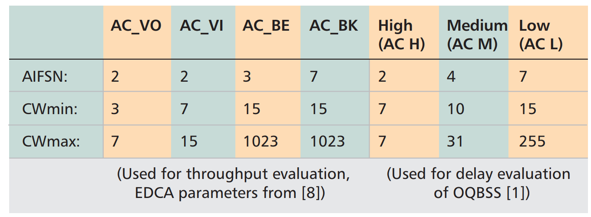
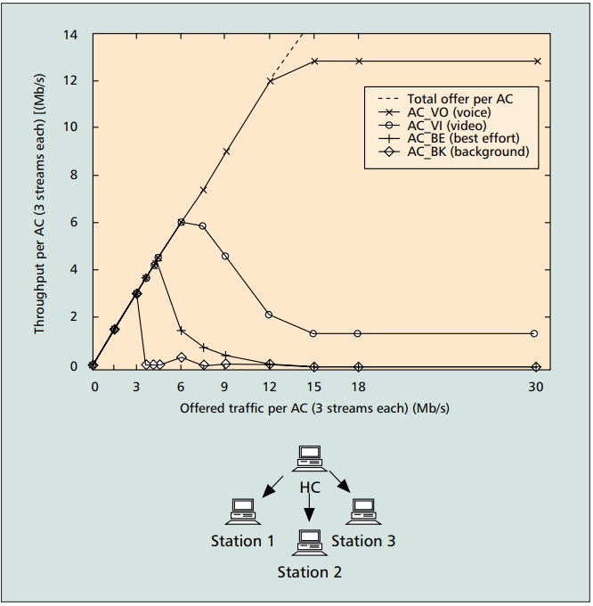
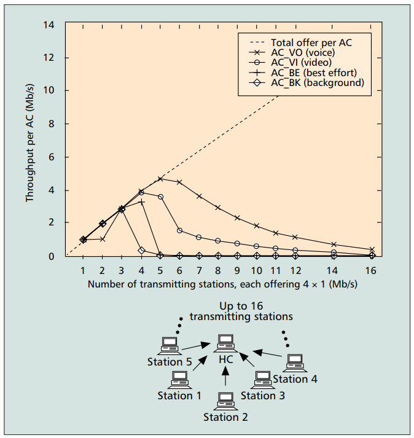
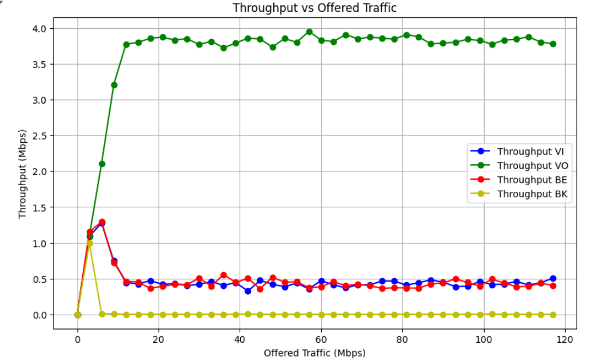

# <center> Assignment 3 </center>

- [ Assignment 3 ](#-assignment-3-)
  - [1. Introduction](#1-introduction)
  - [2. Description of the Original Study](#2-description-of-the-original-study)
  - [3. Simulation Descriptions](#3-simulation-descriptions)
    - [Simulation 1: Achievable EDCA Throughput in an Isolated QBSS with Four Stations.](#simulation-1-achievable-edca-throughput-in-an-isolated-qbss-with-four-stations)
    - [Simulation 2: Achievable EDCA Throughput with Increasing Number of Stations.](#simulation-2-achievable-edca-throughput-with-increasing-number-of-stations)
    - [Simulation 3: QoS Guarantees with Prioritized Access of HC](#simulation-3-qos-guarantees-with-prioritized-access-of-hc)
  - [4. Simulation Code](#4-simulation-code)
    - [Network Configuration](#network-configuration)
      - [Traffic Configuration](#traffic-configuration)
      - [Execution and Data Collection](#execution-and-data-collection)
  - [5. Results](#5-results)
    - [Comparison with Original Research](#comparison-with-original-research)
  - [6. Conclusion](#6-conclusion)

## 1. Introduction

**The pupose of the work:** Duplicate the research paper [result](https://ieeexplore.ieee.org/document/1265851) in the NS-3 simmulator.

**The research paper:** [Performance analysis of the IEEE 802.11e EDCA for QoS support in wireless LANs](https://ieeexplore.ieee.org/document/1265851)

## 2. Description of the Original Study

The study "Analysis of IEEE 802.11e for QoS Support in Wireless LANs" focuses on evaluating the improvements introduced by the IEEE 802.11e standard to support Quality of Service (QoS) in wireless LANs. The older IEEE 802.11 standards, like 802.11a/b/g, mainly provide best-effort service, which isn't enough for applications needing guaranteed service levels, such as voice and video streaming.

To solve this, the IEEE 802.11 working group made enhancements to the MAC protocol, resulting in the 802.11e standard. This standard adds new mechanisms, specifically the Enhanced Distributed Channel Access (EDCA) and the Hybrid Coordination Function (HCF), which includes both contention-based and contention-free access methods.

The original study explains these enhancements and evaluates their ability to support QoS through simulations. It compares the performance of the 802.11e mechanisms with the older 802.11 standard, showing how 802.11e improves handling different traffic types and prioritizing network access for various applications.

Key points from the study include:

- The limitations of the older 802.11 standards in supporting QoS.
- Detailed descriptions of the new QoS mechanisms in 802.11e.
- Simulation results demonstrating how well 802.11e provides QoS under different network conditions.

The simulations show that the 802.11e standard significantly improves the ability of WLANs to support QoS, making it better suited for applications that require reliable and prioritized data transmission.

## 3. Simulation Descriptions

### Simulation 1: Achievable EDCA Throughput in an Isolated QBSS with Four Stations.

In the first simulation, the study evaluates the achievable throughput in an isolated QoS Basic Service Set (QBSS) with four stations. Each station operates under the Enhanced Distributed Channel Access (EDCA) mechanism. The access point (AP) transmits four separate data streams to each of the three stations, amounting to a total of 12 streams. All frames are transmitted at a rate of 24 Mb/s, control frames are transmitted at 6 Mb/s and the default EDCA parameters for the four access categories (AC_VI, AC_VO, AC_BE, and AC_BK) are used. MSDUs size - 512 byte. The arrival of packets follows Poisson process with certain lambda. No RTS/CTS or fragmentation is applied, and each EDCA-TXOP allows the transmission of one data frame. The simulation shows how higher priority access categories (AC_VI and AC_VO) restrict the throughput of lower priority categories (AC_BE and AC_BK) due to smaller values of AIFSN, CWmin, and CWmax, thus demonstrating the prioritization capabilities of EDCA.

**Used EDCA parameters:**

<p  align="center">
  
</p>

**Simulation Results:**

<p  align="center">
  
</p>

### Simulation 2: Achievable EDCA Throughput with Increasing Number of Stations.

The second simulation explores the performance of EDCA as the number of stations increases in an isolated QBSS. Here, each station uses all four access categories (ACs), each transmitting at 250 kb/s, totaling 1 Mb/s per station. The number of stations contending for the medium is gradually increased up to 16. The results indicate a dramatic reduction in throughput as the number of stations grows, especially for the highest priority AC_VO, due to increased collision probabilities. This outcome highlights the challenges in maintaining QoS with a high number of stations and the necessity for dynamic adjustment of EDCA parameters by the Hybrid Coordinator (HC) to manage medium access efficiently.

**Simulation Results:**

<p  align="center">
  
</p>

### Simulation 3: QoS Guarantees with Prioritized Access of HC

The third simulation investigates the QoS guarantees provided by the Hybrid Coordination Function Controlled Channel Access (HCCA) in both isolated and overlapping QBSS scenarios. The focus is on the delivery delays of MSDUs under different conditions. The simulation compares the performance of EDCA and HCCA, showing that HCCA can effectively deliver time-bounded traffic with controlled delays in isolated QBSS. However, in overlapping QBSS, the HCCA's effectiveness diminishes due to lack of coordination between overlapping cells, leading to increased delays. This underscores the importance of proper HC configuration and coordination to ensure QoS in dense network.

**Simulation Results:**

<p  align="center">
  
</p>

## 4. Simulation Code

### Network Configuration

The network configuration involved setting up an Access Point (AP) and three Station (STA) nodes, configuring WiFi channels, and defining traffic parameters. The main steps were as follows:

1. **Node Creation**:

   - Three STA nodes and one AP node were created using `NodeContainer`.

   ```cpp
   NodeContainer wifiStaNodes;
   wifiStaNodes.Create(3);
   NodeContainer wifiApNodes;
   wifiApNodes.Create(1);
   ```

2. **Channel and Physical Layer Configuration**:

   - A default YANS (Yet Another Network Simulator) WiFi channel and PHY layer were configured.

   ```cpp
   YansWifiChannelHelper channel = YansWifiChannelHelper::Default();
   YansWifiPhyHelper phy;
   phy.SetPcapDataLinkType(WifiPhyHelper::DLT_IEEE802_11_RADIO);
   phy.SetChannel(channel.Create());
   phy.Set("ChannelSettings", StringValue("{36, 20, BAND_5GHZ, 0}"));
   ```

3. **WiFi Helper and MAC Setup**:

   - The WiFi standard was set to 802.11a, and the MAC layer was configured to support QoS (Quality of Service).

   ```cpp
   WifiHelper wifi;
   wifi.SetStandard(WIFI_STANDARD_80211a);
   wifi.SetRemoteStationManager("ns3::ConstantRateWifiManager",
                                "DataMode", StringValue("OfdmRate24Mbps"),
                                "ControlMode", StringValue("OfdmRate6Mbps"));
   WifiMacHelper mac;
   ```

4. **Network Devices Installation**:

   - Network devices were installed on both STA and AP nodes.

   ```cpp
   Ssid ssid = Ssid("network");
   mac.SetType("ns3::StaWifiMac", "QosSupported", BooleanValue(true), "Ssid", SsidValue(ssid));
   NetDeviceContainer staDeviceA = wifi.Install(phy, mac, wifiStaNodes.Get(0));
   NetDeviceContainer staDeviceB = wifi.Install(phy, mac, wifiStaNodes.Get(1));
   NetDeviceContainer staDeviceC = wifi.Install(phy, mac, wifiStaNodes.Get(2));
   mac.SetType("ns3::ApWifiMac", "QosSupported", BooleanValue(true), "Ssid", SsidValue(ssid), "EnableBeaconJitter", BooleanValue(false));
   NetDeviceContainer apDeviceA = wifi.Install(phy, mac, wifiApNodes.Get(0));
   ```

5. **EDCA Configuration**:

   - The Enhanced Distributed Channel Access (EDCA) parameters were set for each Access Category (AC) to define different QoS levels.

   ```cpp
   Ptr<NetDevice> dev = wifiApNodes.Get(0)->GetDevice(0);
   Ptr<WifiNetDevice> wifi_dev = DynamicCast<WifiNetDevice>(dev);
   Ptr<WifiMac> wifi_mac = wifi_dev->GetMac();
   PointerValue ptr;
   Ptr<QosTxop> edca;
   wifi_mac->GetAttribute("BE_Txop", ptr);
   edca = ptr.Get<QosTxop>();
   edca->SetAifsn(3);
   edca->SetMinCw(15);
   edca->SetMaxCw(1023);
   wifi_mac->GetAttribute("VO_Txop", ptr);
   edca = ptr.Get<QosTxop>();
   edca->SetAifsn(2);
   edca->SetMinCw(3);
   edca->SetMaxCw(7);
   wifi_mac->GetAttribute("VI_Txop", ptr);
   edca->SetAifsn(3);
   edca->SetMinCw(7);
   edca->SetMaxCw(15);
   wifi_mac->GetAttribute("BK_Txop", ptr);
   edca->SetAifsn(7);
   edca->SetMinCw(15);
   edca->SetMaxCw(1023);
   ```

6. **Mobility and Internet Stack Installation**:

   - Constant position mobility was applied to the nodes, and the internet stack was installed.

   ```cpp
   MobilityHelper mobility;
   mobility.SetMobilityModel("ns3::ConstantPositionMobilityModel");
   mobility.Install(wifiStaNodes);
   mobility.Install(wifiApNodes);
   InternetStackHelper stack;
   stack.Install(wifiApNodes);
   stack.Install(wifiStaNodes);
   ```

7. **IP Address Assignment**:
   - IP addresses were assigned to the network interfaces of the devices.
   ```cpp
   Ipv4AddressHelper address;
   address.SetBase("192.168.1.0", "255.255.255.0");
   Ipv4InterfaceContainer staInterfaceA = address.Assign(staDeviceA);
   Ipv4InterfaceContainer staInterfaceB = address.Assign(staDeviceB);
   Ipv4InterfaceContainer staInterfaceC = address.Assign(staDeviceC);
   Ipv4InterfaceContainer apInterfaceA = address.Assign(apDeviceA);
   ```

#### Traffic Configuration

Traffic was generated using UDP servers and On-Off applications to simulate different types of traffic (Voice, Video, Best Effort, and Background). Each traffic type was associated with a specific UDP port and differentiated by ToS (Type of Service) settings.

1. **UDP Server Configuration**:

   - UDP servers were installed on each STA node for all traffic types.

   ```cpp
   UdpServerHelper serverA_VI(port_VI);
   ApplicationContainer serverAppAVI = serverA_VI.Install(wifiStaNodes.Get(0));
   serverAppAVI.Start(Seconds(0.0));
   serverAppAVI.Stop(Seconds(simulationTimeEnds));
   ```

2. **UDP Client Configuration**:
   - On-Off applications were set up on the AP node to send traffic to the STA nodes.
   ```cpp
   InetSocketAddress destA_VI(staInterfaceA.GetAddress(0), port_VI);
   destA_VI.SetTos(0xb8); // AC_VI
   OnOffHelper clientA_VI("ns3::UdpSocketFactory", destA_VI);
   clientA_VI.SetAttribute("OnTime", PointerValue(CreateExponentialRandomVariableWithMean(0.02)));
   clientA_VI.SetAttribute("OffTime", PointerValue(CreateExponentialRandomVariableWithMean(0.02)));
   clientA_VI.SetAttribute("DataRate", StringValue(std::to_string(offeredTrafficAC) + "Mbps"));
   clientA_VI.SetAttribute("PacketSize", UintegerValue(payloadSize));
   ```

#### Execution and Data Collection

The simulation was executed in a loop to vary the offered traffic load from 0 Mbps to 120 Mbps in steps of 3 Mbps. For each step, the simulation was run for a duration of 4 seconds.

```cpp
for (double offeredTrafficAC{offeredTrafficStart}; offeredTrafficAC <= offeredTrafficEnd; offeredTrafficAC += offeredTrafficStep, i++) {
   // Setup and run simulation
   Simulator::Stop(Seconds(4.0));
   Simulator::Run();
   // Data collection
   uint totalPacketsThroughA_VI = DynamicCast<UdpServer>(serverAppAVI.Get(0))->GetReceived();
   double throughputA_VI = (totalPacketsThroughA_VI * payloadSize * 8.0) / (4 * 1000000.0);
   throughputVI[i] = throughputA_VI;
   // Repeat for other traffic types and nodes
}
Simulator::Destroy();
```

Full code for the network configuration, traffic setup, and data collection can be found in the [simulation code](./A3/4-station-qbss.cpp).

## 5. Results

The matplotlib library was used to construct a graph based on the obtained data.Here is the complete code for plotting the throughput vs. offered traffic data using Matplotlib:

```python
import matplotlib.pyplot as plt
import numpy as np

# Data
offered_traffic = np.arange(0, 120, 3)

Throughput_VI = [
    0.000000, 1.091243, 1.275733, 0.748757, 0.443563, 0.425899, 0.472021, 0.419029,
    0.430805, 0.402347, 0.419029, 0.458283, 0.405291, 0.443563, 0.325803, 0.473984,
    0.421973, 0.386645, 0.435712, 0.357205, 0.471040, 0.414123, 0.369963, 0.410197,
    0.412160, 0.467115, 0.464171, 0.408235, 0.442581, 0.481835, 0.450432, 0.387627,
    0.393515, 0.459264, 0.416085, 0.421973, 0.460245, 0.410197, 0.441600, 0.504405
]
Throughput_VO = [
    0.000000, 1.097131, 2.108885, 3.210923, 3.777152, 3.801685, 3.860565, 3.873323,
    3.834069, 3.853696, 3.771264, 3.816405, 3.727104, 3.790891, 3.861547, 3.849771,
    3.735936, 3.854677, 3.802667, 3.955755, 3.833088, 3.812480, 3.910613, 3.851733,
    3.873323, 3.860565, 3.847808, 3.909632, 3.880192, 3.779115, 3.791872, 3.802667,
    3.844864, 3.828181, 3.777152, 3.833088, 3.844864, 3.879211, 3.806592, 3.783040
]
Throughput_BE = [
    0.000000, 1.152085, 1.293397, 0.727168, 0.462208, 0.451413, 0.363093, 0.393515,
    0.417067, 0.416085, 0.505387, 0.395477, 0.557397, 0.445525, 0.504405, 0.356224,
    0.520107, 0.449451, 0.455339, 0.372907, 0.382720, 0.457301, 0.401365, 0.420011,
    0.400384, 0.363093, 0.371925, 0.368981, 0.367019, 0.424917, 0.438656, 0.495573,
    0.445525, 0.394496, 0.492629, 0.438656, 0.387627, 0.390571, 0.435712, 0.405291
]
Throughput_BK = [
    0.000000, 0.991147, 0.010795, 0.005888, 0.000981, 0.000000, 0.000000, 0.000000,
    0.000981, 0.000000, 0.000000, 0.001963, 0.000000, 0.000000, 0.002944, 0.000000,
    0.000000, 0.001963, 0.000981, 0.000000, 0.000000, 0.001963, 0.000000, 0.000000,
    0.000000, 0.000000, 0.000000, 0.000981, 0.000981, 0.000000, 0.000000, 0.000000,
    0.000981, 0.000000, 0.003925, 0.000000, 0.000000, 0.000000, 0.000000, 0.000000
]

# Graphic creation
plt.figure(figsize=(10, 6))

plt.plot(offered_traffic, Throughput_VI, marker='o', color='b', label='Throughput VI')
plt.plot(offered_traffic, Throughput_VO, marker='o', color='g', label='Throughput VO')
plt.plot(offered_traffic, Throughput_BE, marker='o', color='r', label='Throughput BE')
plt.plot(offered_traffic, Throughput_BK, marker='o', color='y', label='Throughput BK')

plt.title('Throughput vs Offered Traffic')
plt.xlabel('Offered Traffic (Mbps)')
plt.ylabel('Throughput (Mbps)')
plt.legend()
plt.grid(True)
plt.show()
```

**Graph:**

<p  align="center">
  
</p>

### Comparison with Original Research

Our results show throughput values reaching up to approximately 4 Mbps, significantly lower than the 13 Mbps reported in the original research. This discrepancy can be attributed to several factors.

1. Experimental Setup Differences.
   Differences in the experimental setup could explain the variation. The original research might have had a more controlled or optimized simulation environment, leading to higher throughput values. Our simulation could have faced more realistic or constrained conditions, resulting in lower throughput.

2. Network Configuration and Traffic Patterns.
   Variations in network configuration and traffic patterns also likely contributed. The original research might have used different network parameters, such as channel width, modulation schemes, or access point capabilities, which can impact throughput. Additionally, differences in traffic patterns, including packet size and traffic load, could have influenced the results.

## 6. Conclusion

This study aimed to replicate the results of the research paper "Performance Analysis of the IEEE 802.11e EDCA for QoS Support in Wireless LANs" using the NS-3 simulator. Our simulations focused on evaluating the Enhanced Distributed Channel Access (EDCA) mechanism in isolated QoS Basic Service Set (QBSS) environments with varying numbers of stations and different access categories.

**Key Findings:**

1. Throughput Performance: The highest achievable throughput in our simulations was approximately 4 Mbps, which is significantly lower than the 13 Mbps reported in the original study. This discrepancy suggests potential differences in experimental setups, network configurations, and traffic patterns.
2. EDCA Prioritization: Our results confirm the effectiveness of EDCA in prioritizing higher access categories (AC_VO and AC_VI) over lower ones (AC_BE and AC_BK). Higher priority categories consistently achieved better throughput, demonstrating EDCA's ability to provide QoS by managing medium access parameters like AIFSN, CWmin, and CWmax
