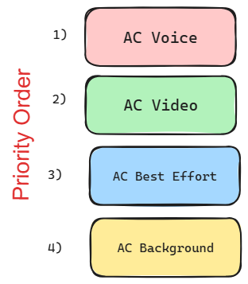
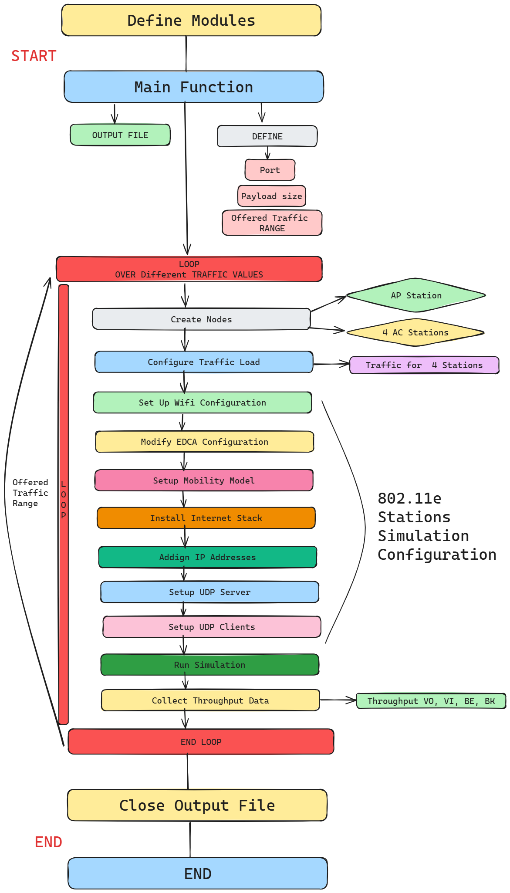
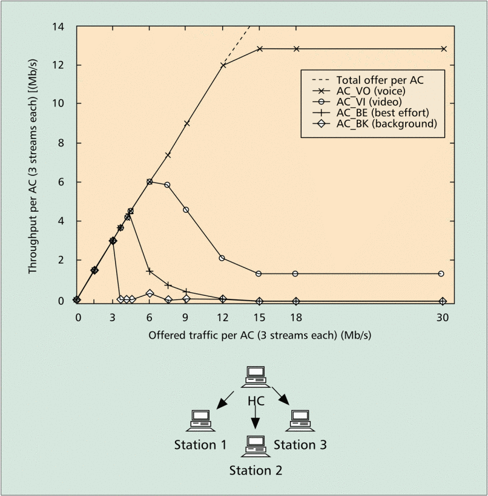

# Assignment 3: IEEE 802.11e simmulation on NS-3

1. **Objective**
    
    - Briefly state the purpose of the assignment.

    Develop a network simulation to assess the performance of IEEE 802.11e using the NS-3 simulator, and compare the obtained results with those presented in the IEEE 802.11e research paper.


2. **Introduction**
    
    - Provide a concise overview of the topic and its significance.

    This project is based on the study "Analysis of IEEE 802.11e for QoS Support in Wireless LANs," which aims to evaluate the performance of the IEEE 802.11e protocol compared to its predecessor, IEEE 802.11. The IEEE 802.11e protocol enhances the MAC sublayer by incorporating Quality of Service (QoS) functionalities into Wi-Fi networks.

    One of the main enhancements introduced by IEEE 802.11e is the prioritization of data packets based on their type, known as Enhanced Distributed Channel Access (EDCA). This mechanism categorizes traffic into different Access Categories (AC) - Voice, Video, Best Effort, and Background - each with a distinct priority level based on its importance and urgency, as illustrated in the following diagram:

    


    The goal of this project is to evaluate the effectiveness of these QoS mechanisms in real-world scenarios, including network congestion, interference, and varying traffic loads. Key performance metrics such as throughput, delay, jitter, and packet loss are considered, but for simplicity, this project focuses on throughput. The simulation involves four stations connected to an Access Point, each representing a different Access Category (Voice, Video, Best Effort, and Background).

    By following this approach, the project aims to verify the improvements brought by IEEE 802.11e in practical settings, comparing the results with those presented in the reference paper.

3. **Simulation/Implementation**
    
    - **Configuration**
        - Describe the simulation or network setup briefly.
    
        - During the simulation configuration, I establish various necessary parameters. These encompass specifying the port number, payload size, start and end times for traffic, and increment values for traffic. Furthermore, the CSV output file is opened to log the simulation results
    - **Flowchart**
        - Include a simple flowchart illustrating the process.

        

    - **Code**


    This NS-3 simulation code sets up a wireless network with three stations (STAs) and one access point (AP) using the IEEE 802.11e standard. The main purpose is to measure throughput across different Access Categories (ACs) - Video (VI), Voice (VO), Best Effort (BE), and Background (BK) - under varying offered traffic loads.

    Key steps include:

    **Node Creation:** Create nodes for three STAs and one AP.
    **Channel and PHY Setup:** Configure the physical layer and channel settings.
    **WiFi and MAC Configuration:** Set up WiFi standards, QoS, and MAC parameters.
    **Network Device Installation:** Install WiFi devices on STAs and AP.
    **EDCA Configuration:** Set TXOP limits and other parameters for different ACs.
    **Mobility and Stack Installation:** Set node mobility and install the internet stack.
    **Address Assignment:** Assign IP addresses to devices.
    **Server and Client Setup:** Configure UDP servers and OnOff clients for each AC.
    **Simulation Execution:** Run the simulation for different traffic loads.
    **Throughput Calculation:** Calculate and log throughput for each AC from all stations.
The throughput results are saved to an output file for analysis.
<details><summary>Click to expand/collapse</summary>
    
```cpp
#include "ns3/applications-module.h"
#include "ns3/command-line.h"
#include "ns3/internet-stack-helper.h"
#include "ns3/ipv4-address-helper.h"
#include "ns3/log.h"
#include "ns3/mobility-helper.h"
#include "ns3/on-off-helper.h"
#include "ns3/pointer.h"
#include "ns3/qos-txop.h"
#include "ns3/ssid.h"
#include "ns3/string.h"
#include "ns3/udp-client-server-helper.h"
#include "ns3/udp-server.h"
#include "ns3/wifi-mac.h"
#include "ns3/wifi-net-device.h"
#include "ns3/yans-wifi-channel.h"
#include "ns3/yans-wifi-helper.h"

using namespace ns3;

Ptr<ExponentialRandomVariable>
CreateExponentialRandomVariableWithMean(double mean)
{
    Ptr<ExponentialRandomVariable> rv = CreateObject<ExponentialRandomVariable>();
    rv->SetAttribute("Mean", DoubleValue(mean));
    return rv;
}

std::string
arrayToString(double array[], int size)
{
    std::string result = "[";
    if (size > 0)
    {
        result += std::to_string(array[0]);
        for (int i = 1; i < size; ++i)
        {
            result += ", " + std::to_string(array[i]);
        }
    }
    result += "]";
    return result;
}

NS_LOG_COMPONENT_DEFINE("80211eTxop");

int main(int argc, char *argv[])
{
    // Open output file for recording characteristics
    std::ofstream outputFile("output_characteristics.txt");

    // Define all neccessary variables
    uint16_t port_VI = 5001;
    uint16_t port_VO = 5002;
    uint16_t port_BE = 5003;
    uint16_t port_BK = 5004;
    uint32_t payloadSize = 1472;
    double offeredTrafficStart = 0.0001;
    double offeredTrafficEnd = 120.0;
    double offeredTrafficStep = 1.0;
    int simulationTimeEnds = 16;
    double tptVI[400], tptVO[400], tptBE[400], tptBK[400];

    // Command-line options for repeatability
    CommandLine cmd;
    cmd.AddValue("offeredTrafficAC", "Offered traffic for AC(Mbps)", offeredTrafficStart);
    cmd.Parse(argc, argv);

    int i = 0;
    // Loop through offeredTraffic values
    for (double offeredTrafficAC{offeredTrafficStart}; offeredTrafficAC <= offeredTrafficEnd;
         offeredTrafficAC += offeredTrafficStep, i++)
    {
        outputFile << "Offered Traffic (Mbps): " << offeredTrafficAC << std::endl;

        // 1. Create nodes. 1 AP and 3 STAs
        NodeContainer wifiStaNodes;
        wifiStaNodes.Create(3);
        NodeContainer wifiApNodes;
        wifiApNodes.Create(1);

        // 2. Create channel and phy
        YansWifiChannelHelper channel = YansWifiChannelHelper::Default();
        YansWifiPhyHelper phy;
        phy.SetPcapDataLinkType(WifiPhyHelper::DLT_IEEE802_11_RADIO);
        phy.SetChannel(channel.Create());
        phy.Set("ChannelSettings", StringValue("{36, 20, BAND_5GHZ, 0}"));

        // 3. Create wifi helper and mac
        WifiHelper wifi;
        wifi.SetStandard(WIFI_STANDARD_80211a);
        wifi.SetRemoteStationManager("ns3::ConstantRateWifiManager",
                                     "DataMode",
                                     StringValue("OfdmRate24Mbps"),
                                     "ControlMode",
                                     StringValue("OfdmRate6Mbps"));
        WifiMacHelper mac;

        // 4. Install network devices
        NetDeviceContainer staDeviceA;
        NetDeviceContainer staDeviceB;
        NetDeviceContainer staDeviceC;
        NetDeviceContainer apDeviceA;
        Ssid ssid;

        // 5. Set up the network devices
        ssid = Ssid("network");
        mac.SetType("ns3::StaWifiMac", "QosSupported", BooleanValue(true), "Ssid", SsidValue(ssid));
        staDeviceA = wifi.Install(phy, mac, wifiStaNodes.Get(0));
        staDeviceB = wifi.Install(phy, mac, wifiStaNodes.Get(1));
        staDeviceC = wifi.Install(phy, mac, wifiStaNodes.Get(2));

        mac.SetType("ns3::ApWifiMac",
                    "QosSupported",
                    BooleanValue(true),
                    "Ssid",
                    SsidValue(ssid),
                    "EnableBeaconJitter",
                    BooleanValue(false));
        apDeviceA = wifi.Install(phy, mac, wifiApNodes.Get(0));

        // Modify EDCA configuration (TXOP limit) for each AC
        Ptr<NetDevice> dev = wifiApNodes.Get(0)->GetDevice(0);
        Ptr<WifiNetDevice> wifi_dev = DynamicCast<WifiNetDevice>(dev);
        Ptr<WifiMac> wifi_mac = wifi_dev->GetMac();
        PointerValue ptr;
        Ptr<QosTxop> edca;
        wifi_mac->GetAttribute("BE_Txop", ptr);
        edca = ptr.Get<QosTxop>();
        edca->SetAifsn(3);
        edca->SetMinCw(15);
        edca->SetMaxCw(1023);

        wifi_mac->GetAttribute("VO_Txop", ptr);
        edca = ptr.Get<QosTxop>();
        edca->SetAifsn(2);
        edca->SetMinCw(3);
        edca->SetMaxCw(7);

        wifi_mac->GetAttribute("VI_Txop", ptr);
        edca = ptr.Get<QosTxop>();
        edca->SetAifsn(3);
        edca->SetMinCw(7);
        edca->SetMaxCw(15);

        wifi_mac->GetAttribute("BK_Txop", ptr);
        edca = ptr.Get<QosTxop>();
        edca->SetAifsn(7);
        edca->SetMinCw(15);
        edca->SetMaxCw(1023);

        MobilityHelper mobility;
        mobility.SetMobilityModel("ns3::ConstantPositionMobilityModel");
        mobility.Install(wifiStaNodes);
        mobility.Install(wifiApNodes);

        InternetStackHelper stack;
        stack.Install(wifiApNodes);
        stack.Install(wifiStaNodes);

        Ipv4AddressHelper address;
        address.SetBase("192.168.1.0", "255.255.255.0");
        Ipv4InterfaceContainer staInterfaceA;
        staInterfaceA = address.Assign(staDeviceA);
        Ipv4InterfaceContainer staInterfaceB;
        staInterfaceB = address.Assign(staDeviceB);
        Ipv4InterfaceContainer staInterfaceC;
        staInterfaceC = address.Assign(staDeviceC);
        Ipv4InterfaceContainer apInterfaceA;
        apInterfaceA = address.Assign(apDeviceA);

        // server A
        UdpServerHelper serverA_VI(port_VI);
        ApplicationContainer serverAppAVI = serverA_VI.Install(wifiStaNodes.Get(0));
        serverAppAVI.Start(Seconds(0.0));
        serverAppAVI.Stop(Seconds(simulationTimeEnds));

        UdpServerHelper serverA_VO(port_VO);
        ApplicationContainer serverAppAVO = serverA_VO.Install(wifiStaNodes.Get(0));
        serverAppAVO.Start(Seconds(0.0));
        serverAppAVO.Stop(Seconds(simulationTimeEnds));

        UdpServerHelper serverA_BE(port_BE);
        ApplicationContainer serverAppABE = serverA_BE.Install(wifiStaNodes.Get(0));
        serverAppABE.Start(Seconds(0.0));
        serverAppABE.Stop(Seconds(simulationTimeEnds));

        UdpServerHelper serverA_BK(port_BK);
        ApplicationContainer serverAppABK = serverA_BK.Install(wifiStaNodes.Get(0));
        serverAppABK.Start(Seconds(0.0));
        serverAppABK.Stop(Seconds(simulationTimeEnds));

        // server B
        UdpServerHelper serverB_VI(port_VI);
        ApplicationContainer serverAppBVI = serverB_VI.Install(wifiStaNodes.Get(1));
        serverAppBVI.Start(Seconds(0.0));
        serverAppBVI.Stop(Seconds(simulationTimeEnds));

        UdpServerHelper serverB_VO(port_VO);
        ApplicationContainer serverAppBVO = serverB_VO.Install(wifiStaNodes.Get(1));
        serverAppBVO.Start(Seconds(0.0));
        serverAppBVO.Stop(Seconds(simulationTimeEnds));

        UdpServerHelper serverB_BE(port_BE);
        ApplicationContainer serverAppBBE = serverB_BE.Install(wifiStaNodes.Get(1));
        serverAppBBE.Start(Seconds(0.0));
        serverAppBBE.Stop(Seconds(simulationTimeEnds));

        UdpServerHelper serverB_BK(port_BK);
        ApplicationContainer serverAppBBK = serverB_BK.Install(wifiStaNodes.Get(1));
        serverAppBBK.Start(Seconds(0.0));
        serverAppBBK.Stop(Seconds(simulationTimeEnds));

        // server C
        UdpServerHelper serverC_VI(port_VI);
        ApplicationContainer serverAppCVI = serverC_VI.Install(wifiStaNodes.Get(2));
        serverAppCVI.Start(Seconds(0.0));
        serverAppCVI.Stop(Seconds(simulationTimeEnds));

        UdpServerHelper serverC_VO(port_VO);
        ApplicationContainer serverAppCVO = serverC_VO.Install(wifiStaNodes.Get(2));
        serverAppCVO.Start(Seconds(0.0));
        serverAppCVO.Stop(Seconds(simulationTimeEnds));

        UdpServerHelper serverC_BE(port_BE);
        ApplicationContainer serverAppCBE = serverC_BE.Install(wifiStaNodes.Get(2));
        serverAppCBE.Start(Seconds(0.0));
        serverAppCBE.Stop(Seconds(simulationTimeEnds));

        UdpServerHelper serverC_BK(port_BK);
        ApplicationContainer serverAppCBK = serverC_BK.Install(wifiStaNodes.Get(2));
        serverAppCBK.Start(Seconds(0.0));
        serverAppCBK.Stop(Seconds(simulationTimeEnds));

        // Create clients

        InetSocketAddress destA_VI(staInterfaceA.GetAddress(0), port_VI);
        destA_VI.SetTos(0xb8); // AC_VI

        InetSocketAddress destA_VO(staInterfaceA.GetAddress(0), port_VO);
        destA_VO.SetTos(0xc0); // AC_VO

        InetSocketAddress destA_BE(staInterfaceA.GetAddress(0), port_BE);
        destA_BE.SetTos(0xa0); // AC_BE

        InetSocketAddress destA_BK(staInterfaceA.GetAddress(0), port_BK);
        destA_BK.SetTos(0x20); // AC_BK

        InetSocketAddress destB_VI(staInterfaceB.GetAddress(0), port_VI);
        destB_VI.SetTos(0xb8); // AC_VI

        InetSocketAddress destB_VO(staInterfaceB.GetAddress(0), port_VO);
        destB_VO.SetTos(0xc0); // AC_VO

        InetSocketAddress destB_BE(staInterfaceB.GetAddress(0), port_BE);
        destB_BE.SetTos(0xa0); // AC_BE

        InetSocketAddress destB_BK(staInterfaceB.GetAddress(0), port_BK);
        destB_BK.SetTos(0x20); // AC_BK

        InetSocketAddress destC_VI(staInterfaceC.GetAddress(0), port_VI);
        destC_VI.SetTos(0xb8); // AC_VI

        InetSocketAddress destC_VO(staInterfaceC.GetAddress(0), port_VO);
        destC_VO.SetTos(0xc0); // AC_VO

        InetSocketAddress destC_BE(staInterfaceC.GetAddress(0), port_BE);
        destC_BE.SetTos(0xa0); // AC_BE

        InetSocketAddress destC_BK(staInterfaceC.GetAddress(0), port_BK);
        destC_BK.SetTos(0x20); // AC_BK

        OnOffHelper clientA_VI("ns3::UdpSocketFactory", destA_VI);
        clientA_VI.SetAttribute("OnTime",
                                PointerValue(CreateExponentialRandomVariableWithMean(0.02)));
        clientA_VI.SetAttribute("OffTime",
                                PointerValue(CreateExponentialRandomVariableWithMean(0.02)));
        clientA_VI.SetAttribute("DataRate", StringValue(std::to_string(offeredTrafficAC) + "Mbps"));
        clientA_VI.SetAttribute("PacketSize", UintegerValue(payloadSize));

        OnOffHelper clientA_VO("ns3::UdpSocketFactory", destA_VO);
        clientA_VO.SetAttribute("OnTime",
                                PointerValue(CreateExponentialRandomVariableWithMean(0.02)));
        clientA_VO.SetAttribute("OffTime",
                                PointerValue(CreateExponentialRandomVariableWithMean(0.02)));
        clientA_VO.SetAttribute("DataRate", StringValue(std::to_string(offeredTrafficAC) + "Mbps"));
        clientA_VO.SetAttribute("PacketSize", UintegerValue(payloadSize));

        OnOffHelper clientA_BE("ns3::UdpSocketFactory", destA_BE);
        clientA_BE.SetAttribute("OnTime",
                                PointerValue(CreateExponentialRandomVariableWithMean(0.02)));
        clientA_BE.SetAttribute("OffTime",
                                PointerValue(CreateExponentialRandomVariableWithMean(0.02)));
        clientA_BE.SetAttribute("DataRate", StringValue(std::to_string(offeredTrafficAC) + "Mbps"));
        clientA_BE.SetAttribute("PacketSize", UintegerValue(payloadSize));

        OnOffHelper clientA_BK("ns3::UdpSocketFactory", destA_BK);
        clientA_BK.SetAttribute("OnTime",
                                PointerValue(CreateExponentialRandomVariableWithMean(0.02)));
        clientA_BK.SetAttribute("OffTime",
                                PointerValue(CreateExponentialRandomVariableWithMean(0.02)));
        clientA_BK.SetAttribute("DataRate", StringValue(std::to_string(offeredTrafficAC) + "Mbps"));
        clientA_BK.SetAttribute("PacketSize", UintegerValue(payloadSize));

        OnOffHelper clientB_VI("ns3::UdpSocketFactory", destB_VI);
        clientB_VI.SetAttribute("OnTime",
                                PointerValue(CreateExponentialRandomVariableWithMean(0.02)));
        clientB_VI.SetAttribute("OffTime",
                                PointerValue(CreateExponentialRandomVariableWithMean(0.02)));
        clientB_VI.SetAttribute("DataRate", StringValue(std::to_string(offeredTrafficAC) + "Mbps"));
        clientB_VI.SetAttribute("PacketSize", UintegerValue(payloadSize));

        OnOffHelper clientB_VO("ns3::UdpSocketFactory", destB_VO);
        clientB_VO.SetAttribute("OnTime",
                                PointerValue(CreateExponentialRandomVariableWithMean(0.02)));
        clientB_VO.SetAttribute("OffTime",
                                PointerValue(CreateExponentialRandomVariableWithMean(0.02)));
        clientB_VO.SetAttribute("DataRate", StringValue(std::to_string(offeredTrafficAC) + "Mbps"));
        clientB_VO.SetAttribute("PacketSize", UintegerValue(payloadSize));

        OnOffHelper clientB_BE("ns3::UdpSocketFactory", destB_BE);
        clientB_BE.SetAttribute("OnTime",
                                PointerValue(CreateExponentialRandomVariableWithMean(0.02)));
        clientB_BE.SetAttribute("OffTime",
                                PointerValue(CreateExponentialRandomVariableWithMean(0.02)));
        clientB_BE.SetAttribute("DataRate", StringValue(std::to_string(offeredTrafficAC) + "Mbps"));
        clientB_BE.SetAttribute("PacketSize", UintegerValue(payloadSize));

        OnOffHelper clientB_BK("ns3::UdpSocketFactory", destB_BK);
        clientB_BK.SetAttribute("OnTime",
                                PointerValue(CreateExponentialRandomVariableWithMean(0.02)));
        clientB_BK.SetAttribute("OffTime",
                                PointerValue(CreateExponentialRandomVariableWithMean(0.02)));
        clientB_BK.SetAttribute("DataRate", StringValue(std::to_string(offeredTrafficAC) + "Mbps"));
        clientB_BK.SetAttribute("PacketSize", UintegerValue(payloadSize));

        OnOffHelper clientC_VI("ns3::UdpSocketFactory", destC_VI);
        clientC_VI.SetAttribute("OnTime",
                                PointerValue(CreateExponentialRandomVariableWithMean(0.02)));
        clientC_VI.SetAttribute("OffTime",
                                PointerValue(CreateExponentialRandomVariableWithMean(0.02)));
        clientC_VI.SetAttribute("DataRate", StringValue(std::to_string(offeredTrafficAC) + "Mbps"));
        clientC_VI.SetAttribute("PacketSize", UintegerValue(payloadSize));

        OnOffHelper clientC_VO("ns3::UdpSocketFactory", destC_VO);
        clientC_VO.SetAttribute("OnTime",
                                PointerValue(CreateExponentialRandomVariableWithMean(0.02)));
        clientC_VO.SetAttribute("OffTime",
                                PointerValue(CreateExponentialRandomVariableWithMean(0.02)));
        clientC_VO.SetAttribute("DataRate", StringValue(std::to_string(offeredTrafficAC) + "Mbps"));
        clientC_VO.SetAttribute("PacketSize", UintegerValue(payloadSize));

        OnOffHelper clientC_BE("ns3::UdpSocketFactory", destC_BE);
        clientC_BE.SetAttribute("OnTime",
                                PointerValue(CreateExponentialRandomVariableWithMean(0.02)));
        clientC_BE.SetAttribute("OffTime",
                                PointerValue(CreateExponentialRandomVariableWithMean(0.02)));
        clientC_BE.SetAttribute("DataRate", StringValue(std::to_string(offeredTrafficAC) + "Mbps"));
        clientC_BE.SetAttribute("PacketSize", UintegerValue(payloadSize));

        OnOffHelper clientC_BK("ns3::UdpSocketFactory", destC_BK);
        clientC_BK.SetAttribute("OnTime",
                                PointerValue(CreateExponentialRandomVariableWithMean(0.02)));
        clientC_BK.SetAttribute("OffTime",
                                PointerValue(CreateExponentialRandomVariableWithMean(0.02)));
        clientC_BK.SetAttribute("DataRate", StringValue(std::to_string(offeredTrafficAC) + "Mbps"));
        clientC_BK.SetAttribute("PacketSize", UintegerValue(payloadSize));

        // Client A
        ApplicationContainer clientAppA_VI = clientA_VI.Install(wifiApNodes.Get(0));
        clientAppA_VI.Start(Seconds(1));
        clientAppA_VI.Stop(Seconds(simulationTimeEnds));

        ApplicationContainer clientAppA_VO = clientA_VO.Install(wifiApNodes.Get(0));
        clientAppA_VO.Start(Seconds(1));
        clientAppA_VO.Stop(Seconds(simulationTimeEnds));

        ApplicationContainer clientAppA_BE = clientA_BE.Install(wifiApNodes.Get(0));
        clientAppA_BE.Start(Seconds(1));
        clientAppA_BE.Stop(Seconds(simulationTimeEnds));

        ApplicationContainer clientAppA_BK = clientA_BK.Install(wifiApNodes.Get(0));
        clientAppA_BK.Start(Seconds(1));
        clientAppA_BK.Stop(Seconds(simulationTimeEnds));

        // Client B
        ApplicationContainer clientAppB_VI = clientB_VI.Install(wifiApNodes.Get(0));
        clientAppB_VI.Start(Seconds(1));
        clientAppB_VI.Stop(Seconds(simulationTimeEnds));

        ApplicationContainer clientAppB_VO = clientB_VO.Install(wifiApNodes.Get(0));
        clientAppB_VO.Start(Seconds(1));
        clientAppB_VO.Stop(Seconds(simulationTimeEnds));

        ApplicationContainer clientAppB_BE = clientB_BE.Install(wifiApNodes.Get(0));
        clientAppB_BE.Start(Seconds(1));
        clientAppB_BE.Stop(Seconds(simulationTimeEnds));

        ApplicationContainer clientAppB_BK = clientB_BK.Install(wifiApNodes.Get(0));
        clientAppB_BK.Start(Seconds(1));
        clientAppB_BK.Stop(Seconds(simulationTimeEnds));

        // Client C
        ApplicationContainer clientAppC_VI = clientC_VI.Install(wifiApNodes.Get(0));
        clientAppC_VI.Start(Seconds(1));
        clientAppC_VI.Stop(Seconds(simulationTimeEnds));

        ApplicationContainer clientAppC_VO = clientC_VO.Install(wifiApNodes.Get(0));
        clientAppC_VO.Start(Seconds(1));
        clientAppC_VO.Stop(Seconds(simulationTimeEnds));

        ApplicationContainer clientAppC_BE = clientC_BE.Install(wifiApNodes.Get(0));
        clientAppC_BE.Start(Seconds(1));
        clientAppC_BE.Stop(Seconds(simulationTimeEnds));

        ApplicationContainer clientAppC_BK = clientC_BK.Install(wifiApNodes.Get(0));
        clientAppC_BK.Start(Seconds(1));
        clientAppC_BK.Stop(Seconds(simulationTimeEnds));

        // Run the simulation
        Simulator::Stop(Seconds(4.0));
        Simulator::Run();

        uint totalPacketsThroughA_VI = DynamicCast<UdpServer>(serverAppAVI.Get(0))->GetReceived();
        uint totalPacketsThroughA_VO = DynamicCast<UdpServer>(serverAppAVO.Get(0))->GetReceived();
        uint totalPacketsThroughA_BE = DynamicCast<UdpServer>(serverAppABE.Get(0))->GetReceived();
        uint totalPacketsThroughA_BK = DynamicCast<UdpServer>(serverAppABK.Get(0))->GetReceived();

        uint totalPacketsThroughB_VI = DynamicCast<UdpServer>(serverAppBVI.Get(0))->GetReceived();
        uint totalPacketsThroughB_VO = DynamicCast<UdpServer>(serverAppBVO.Get(0))->GetReceived();
        uint totalPacketsThroughB_BE = DynamicCast<UdpServer>(serverAppBBE.Get(0))->GetReceived();
        uint totalPacketsThroughB_BK = DynamicCast<UdpServer>(serverAppBBK.Get(0))->GetReceived();

        uint totalPacketsThroughC_VI = DynamicCast<UdpServer>(serverAppCVI.Get(0))->GetReceived();
        uint totalPacketsThroughC_VO = DynamicCast<UdpServer>(serverAppCVO.Get(0))->GetReceived();
        uint totalPacketsThroughC_BE = DynamicCast<UdpServer>(serverAppCBE.Get(0))->GetReceived();
        uint totalPacketsThroughC_BK = DynamicCast<UdpServer>(serverAppCBK.Get(0))->GetReceived();

        Simulator::Destroy();

        double tptA_VI = (totalPacketsThroughA_VI * payloadSize * 8.) / (4 * 1000000.);
        double tptA_VO = (totalPacketsThroughA_VO * payloadSize * 8.) / (4 * 1000000.);
        double tptA_BE = (totalPacketsThroughA_BE * payloadSize * 8.) / (4 * 1000000.);
        double tptA_BK = (totalPacketsThroughA_BK * payloadSize * 8.) / (4 * 1000000.);

        double tptB_VI = (totalPacketsThroughB_VI * payloadSize * 8.) / (4 * 1000000.);
        double tptB_VO = (totalPacketsThroughB_VO * payloadSize * 8.) / (4 * 1000000.);
        double tptB_BE = (totalPacketsThroughB_BE * payloadSize * 8.) / (4 * 1000000.);
        double tptB_BK = (totalPacketsThroughB_BK * payloadSize * 8.) / (4 * 1000000.);

        double tptC_VI = (totalPacketsThroughC_VI * payloadSize * 8.) / (4 * 1000000.);
        double tptC_VO = (totalPacketsThroughC_VO * payloadSize * 8.) / (4 * 1000000.);
        double tptC_BE = (totalPacketsThroughC_BE * payloadSize * 8.) / (4 * 1000000.);
        double tptC_BK = (totalPacketsThroughC_BK * payloadSize * 8.) / (4 * 1000000.);

        tptVI[i] = (throughputA_VI + throughputB_VI + throughputC_VI) / 3;
        tptVO[i] = (throughputA_VO + throughputB_VO + throughputC_VO) / 3;
        tptBE[i] = (throughputA_BE + throughputB_BE + throughputC_BE) / 3;
        tptBK[i] = (throughputA_BK + throughputB_BK + throughputC_BK) / 3;

        output << "Throughput A (VI): " << throughputA_VI << " Mbps" << std::endl;
        output << "Throughput A (VO): " << throughputA_VO << " Mbps" << std::endl;
        output << "Throughput A (BE): " << throughputA_BE << " Mbps" << std::endl;
        output << "Throughput A (BK): " << throughputA_BK << " Mbps" << std::endl;

        output << "Throughput B (VI): " << throughputB_VI << " Mbps" << std::endl;
        output << "Throughput B (VO): " << throughputB_VO << " Mbps" << std::endl;
        output << "Throughput B (BE): " << throughputB_BE << " Mbps" << std::endl;
        output << "Throughput B (BK): " << throughputB_BK << " Mbps" << std::endl;

        output << "Throughput C (VI): " << throughputC_VI << " Mbps" << std::endl;
        output << "Throughput C (VO): " << throughputC_VO << " Mbps" << std::endl;
        output << "Throughput C (BE): " << throughputC_BE << " Mbps" << std::endl;
        output << "Throughput C (BK): " << throughputC_BK << " Mbps" << std::endl;
    }

    outputFile << "Throughput_VI = " << arrayToString(throughputVI, i) << std::endl;
    outputFile << "Throughput_VO = " << arrayToString(throughputVO, i) << std::endl;
    outputFile << "Throughput_BE = " << arrayToString(throughputBE, i) << std::endl;
    outputFile << "Throughput_BK = " << arrayToString(throughputBK, i) << std::endl;
    outputFile.close();
    return 0;
}


```
</details>


4. **Results and Analysis**
    
    - Display the results and provide a brief analysis of what they indicate.
    
    
    My results:
    
    
    Paper results:
    
    
    
    We notice that the overall pattern is quite similar, though not identical. This discrepancy may be due to variations in the randomized results or minor differences in the code, likely stemming from my limited experience with the ns3 environment.

    As anticipated, the Voice Access Category receives the highest priority and remains unaffected even at higher traffic levels.

    The Video Access Category also has a high priority but begins to experience limitations as traffic increases.

    The Best Effort Access Category is the next to decline when traffic increases further. However, it closely resembles the Voice Access Category, indicating only a slight inaccuracy.

    The Background Access Category is the first to be restricted, giving higher priority to the other categories.
    
5. **Conclusion**
    - Summarize the key findings and any challenges encountered
    
    
    I gained significant insights into how QoS in 802.11e effectively enhances the user experience in network connections.

    Additionally, I learned extensively about NS3 and its use with C++ to simulate networks, enabling quick and efficient creation of prototypes and test environments.

    This experiment was valuable for both understanding the subject matter and analyzing the paper to extract key details.
    
    
6. **References**
    - List any sources or references used.

- [Analysis of IEEE 802.11e for QoS support in wireless LANs](https://ieeexplore.ieee.org/stamp/stamp.jsp?tp=&arnumber=1265851)
- [Documentation NS-3](https://www.nsnam.org/documentation/)
- [NS-3 Installation Guide PDF](https://www.nsnam.org/docs/installation/ns-3-installation.pdf)
- [Udemy Course: Getting Started with NS-3](https://www.udemy.com/course/getting-started-with-network-simulator-3/?couponCode=ST8MT40924)
