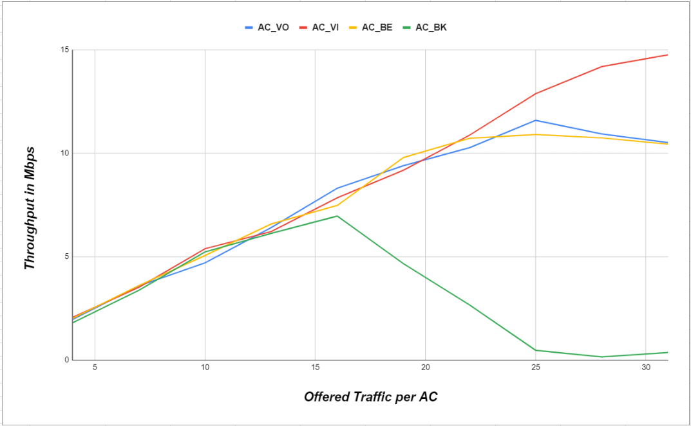

# Assignment 3: IEEE 802.11e simmulation on NS-3

1. **Objective**
    
    The assignment aims to create a network simulation to evaluate the performance of IEEE 802.11e using the NS-3 simulator. The results obtained from the simulation will be compared to those presented in the original IEEE 802.11e research paper to validate and analyze the findings.


2. **Introduction**
    
    This project revolves around the study titled "Analysis of IEEE 802.11e for QoS Support in Wireless LANs." The primary goal is to assess the performance of the IEEE 802.11e protocol and compare it to its predecessor, IEEE 802.11. The IEEE 802.11e protocol enhances the MAC sublayer by integrating Quality of Service (QoS) functionalities into Wi-Fi networks.

    One of the key improvements introduced by IEEE 802.11e is the prioritization of data packets according to their type, known as Enhanced Distributed Channel Access (EDCA). This mechanism classifies traffic into different Access Categories (AC) - Voice, Video, Best Effort, and Background. Each category is assigned a specific priority level based on its significance and urgency, ensuring efficient data handling and better network performance.

    


    The goal of this project is to assess the effectiveness of these QoS mechanisms in real-world scenarios, such as network congestion, interference, and varying traffic loads. While various performance metrics like throughput, delay, jitter, and packet loss are crucial, this project specifically focuses on throughput. The simulation setup includes four stations connected to an Access Point, each station representing a different Access Category: Voice, Video, Best Effort, and Background.

    Through this approach, the project aims to validate the improvements introduced by IEEE 802.11e in practical settings, comparing the results with those documented in the reference paper.

3. **Simulation/Implementation**
    
    - **Configuration**
    
        - During the simulation configuration, I set up various essential parameters. These include specifying the port number, payload size, start and end times for traffic, and increment values for traffic. Additionally, I open the CSV output file to log the simulation results, ensuring all data is accurately recorded for analysis.
        
    - **Flowchart**

        

    - **Code**


    This NS-3 simulation code sets up a wireless network with three stations (STAs) and one access point (AP) using the IEEE 802.11e standard. The main purpose is to measure throughput across different Access Categories (ACs) - Video (VI), Voice (VO), Best Effort (BE), and Background (BK) - under varying offered traffic loads.

    Key steps include:

    **Node Creation:** Create nodes for three STAs and one AP.
    **Channel and PHY Setup:** Configure the physical layer and channel settings.
    **WiFi and MAC Configuration:** Set up WiFi standards, QoS, and MAC parameters.
    **Network Device Installation:** Install WiFi devices on STAs and AP.
    **EDCA Configuration:** Set TXOP limits and other parameters for different ACs.
    **Mobility and Stack Installation:** Set node mobility and install the internet stack.
    **Address Assignment:** Assign IP addresses to devices.
    **Server and Client Setup:** Configure UDP servers and OnOff clients for each AC.
    **Simulation Execution:** Run the simulation for different traffic loads.
    **Throughput Calculation:** Calculate and log throughput for each AC from all stations.
    The throughput results are saved to an output file for analysis.
<details><summary>Click to expand/collapse</summary>
    
```cpp
#include "ns3/command-line.h"
#include "ns3/internet-stack-helper.h"
#include "ns3/ipv4-address-helper.h"
#include "ns3/log.h"
#include "ns3/mobility-helper.h"
#include "ns3/on-off-helper.h"
#include "ns3/ssid.h"
#include "ns3/string.h"
#include "ns3/udp-client-server-helper.h"
#include "ns3/udp-server.h"
#include "ns3/wifi-mac.h"
#include "ns3/wifi-net-device.h"
#include "ns3/yans-wifi-channel.h"
#include "ns3/yans-wifi-helper.h"
#include "ns3/packet.h"
#include "ns3/flow-monitor.h"
#include "ns3/ipv4-flow-classifier.h"
#include "ns3/flow-monitor-helper.h"
#include "ns3/boolean.h"  
#include "ns3/pointer.h"  
#include "ns3/qos-txop.h" 
#include <fstream> 
#include <sstream>
#include <iomanip>

using namespace ns3;

NS_LOG_COMPONENT_DEFINE("80211eTxop");


// Simulation parameters
uint16_t port = 6969;
uint32_t payloadSize = 1472; // bytes
double trafficStart = 1.0;
double trafficEnd = 30.0;
double trafficIncrement = 3.0;

int iterations = trafficEnd / trafficIncrement;


void RunSimulation(int iteration)
{
    std::stringstream fileNameStream;
    fileNameStream << "/home/mateoalvarenga/Desktop/simulations" << std::setfill('0') << std::setw(2) << iteration << ".csv";
    std::string fileName = fileNameStream.str();


    // Open the output file 
    std::ofstream outFileCSV(fileName);
    if (!outFileCSV.is_open()) {
        NS_LOG_ERROR("Unable to open output file.");
        return;
    }
    std::cout << "Output file " << fileName << " has been opened." << std::endl;

    for(int i = 0; i <= iterations; i++)
    {
        double currentTrafficAC = trafficStart + (i * trafficIncrement);

        // Set up 1 AP and 4 STAs (Voice, Video, Best Effort, Background) and set channels & Network
        NodeContainer wifiStaNodes;
        wifiStaNodes.Create(4); // 4 STAs for 4 different ACs
        NodeContainer wifiApNodes;
        wifiApNodes.Create(1);

        YansWifiChannelHelper channel = YansWifiChannelHelper::Default();
        YansWifiPhyHelper phy;
        phy.SetPcapDataLinkType(WifiPhyHelper::DLT_IEEE802_11_RADIO);
        phy.SetChannel(channel.Create());

        WifiHelper wifi;
        wifi.SetStandard(WIFI_STANDARD_80211a);
        wifi.SetRemoteStationManager("ns3::IdealWifiManager");
        WifiMacHelper mac;

        NetDeviceContainer staDevice[4];
        NetDeviceContainer apDevice;
        Ssid ssid = Ssid("network");
        phy.Set("ChannelSettings", StringValue("{36, 20, BAND_5GHZ, 0}"));

        // Setup QoS MAC for STAs
        mac.SetType("ns3::StaWifiMac", "QosSupported", BooleanValue(true), "Ssid", SsidValue(ssid));
        for (int j = 0; j < 4; j++) {
            staDevice[j] = wifi.Install(phy, mac, wifiStaNodes.Get(j));
        }

        // Setup QoS MAC for AP
        mac.SetType("ns3::ApWifiMac", "QosSupported", BooleanValue(true), "Ssid", SsidValue(ssid), "EnableBeaconJitter", BooleanValue(false));
        apDevice = wifi.Install(phy, mac, wifiApNodes.Get(0));

        // QoS configuration for AP
        Ptr<NetDevice> dev = wifiApNodes.Get(0)->GetDevice(0);
        Ptr<WifiNetDevice> wifi_dev = DynamicCast<WifiNetDevice>(dev);
        Ptr<WifiMac> wifi_mac = wifi_dev->GetMac();
        PointerValue ptr;
        Ptr<QosTxop> edca;

        // Configure EDCA for AC_VI (Video)
        wifi_mac->GetAttribute("VI_Txop", ptr);
        edca = ptr.Get<QosTxop>();
        edca->SetAifsn(3);
        edca->SetMinCw(7);
        edca->SetMaxCw(15);

        // Configure EDCA for AC_VO (Voice)
        wifi_mac->GetAttribute("VO_Txop", ptr);
        edca = ptr.Get<QosTxop>();
        edca->SetAifsn(2);
        edca->SetMinCw(3);
        edca->SetMaxCw(6);

        // Configure EDCA for AC_BE (Best Effort)
        wifi_mac->GetAttribute("BE_Txop", ptr);
        edca = ptr.Get<QosTxop>();
        edca->SetAifsn(4);
        edca->SetMinCw(15);
        edca->SetMaxCw(1023);

        // Configure EDCA for AC_BK (Background)
        wifi_mac->GetAttribute("BK_Txop", ptr);
        edca = ptr.Get<QosTxop>();
        edca->SetAifsn(7);
        edca->SetMinCw(15);
        edca->SetMaxCw(1023);

        MobilityHelper mobility;
        mobility.SetMobilityModel("ns3::ConstantPositionMobilityModel");
        mobility.Install(wifiStaNodes);
        mobility.Install(wifiApNodes);

        InternetStackHelper stack;
        stack.Install(wifiApNodes);
        stack.Install(wifiStaNodes);

        Ipv4AddressHelper address;
        address.SetBase("192.168.1.0", "255.255.255.0");
        Ipv4InterfaceContainer staInterface[4];
        Ipv4InterfaceContainer apInterface;
        for (int j = 0; j < 4; j++) {
            staInterface[j] = address.Assign(staDevice[j]);
        }
        apInterface = address.Assign(apDevice);

        UdpServerHelper server[4];
        ApplicationContainer serverApp[4];
        for (int j = 0; j < 4; j++) {
            server[j] = UdpServerHelper(port);
            serverApp[j] = server[j].Install(wifiStaNodes.Get(j));
            serverApp[j].Start(Seconds(0.0));
            serverApp[j].Stop(Seconds(4.0));
        }

        // Initialize the InetSocketAddress array with valid IPv4 addresses and ports
        InetSocketAddress dest[4] = {
            InetSocketAddress(staInterface[0].GetAddress(0), port), // AC_VI
            InetSocketAddress(staInterface[1].GetAddress(0), port), // AC_VO
            InetSocketAddress(staInterface[2].GetAddress(0), port), // AC_BE
            InetSocketAddress(staInterface[3].GetAddress(0), port)  // AC_BK
        };

        dest[0] = InetSocketAddress(staInterface[0].GetAddress(0), port); // AC_VI
        dest[0].SetTos(0xb8);
        dest[1] = InetSocketAddress(staInterface[1].GetAddress(0), port); // AC_VO
        dest[1].SetTos(0xc0);
        dest[2] = InetSocketAddress(staInterface[2].GetAddress(0), port); // AC_BE
        dest[2].SetTos(0xa0);
        dest[3] = InetSocketAddress(staInterface[3].GetAddress(0), port); // AC_BK
        dest[3].SetTos(0x20);

        Ptr<ExponentialRandomVariable> onTimeRv = CreateObject<ExponentialRandomVariable>();
        onTimeRv->SetAttribute("Mean", DoubleValue(0.02));

        Ptr<ExponentialRandomVariable> offTimeRv = CreateObject<ExponentialRandomVariable>();
        offTimeRv->SetAttribute("Mean", DoubleValue(0.02));

        // Clients Configuration and Simulation
        
        // Initialize the OnOffHelper array with the required arguments
        OnOffHelper client[4] = {
            OnOffHelper("ns3::UdpSocketFactory", dest[0]), // AC_VI
            OnOffHelper("ns3::UdpSocketFactory", dest[1]), // AC_VO
            OnOffHelper("ns3::UdpSocketFactory", dest[2]), // AC_BE
            OnOffHelper("ns3::UdpSocketFactory", dest[3])  // AC_BK
        };
        ApplicationContainer clientApp[4];
        for (int j = 0; j < 4; j++) {
            client[j] = OnOffHelper("ns3::UdpSocketFactory", dest[j]);
            client[j].SetAttribute("OnTime", PointerValue(onTimeRv));
            client[j].SetAttribute("OffTime", PointerValue(offTimeRv));
            client[j].SetAttribute("DataRate", StringValue(std::to_string(currentTrafficAC) + "Mbps"));
            client[j].SetAttribute("PacketSize", UintegerValue(payloadSize));
            clientApp[j] = client[j].Install(wifiApNodes.Get(0));
            clientApp[j].Start(Seconds(1.0));
            clientApp[j].Stop(Seconds(4.0));
        }

        // Run the simulation
        Simulator::Stop(Seconds(4.0));
        Simulator::Run();

        uint32_t totalPacketsThrough[4];
        for (int j = 0; j < 4; j++) {
            totalPacketsThrough[j] = DynamicCast<UdpServer>(serverApp[j].Get(0))->GetReceived();
        }

        Simulator::Destroy();

        // Calculate throughput
        double throughput[4];
        for (int j = 0; j < 4; j++) {
            throughput[j] = (totalPacketsThrough[j] * payloadSize * 8.0) / (3 * 1000000.0); // Mbps
        }

        // Display Results in console
        std::cout << "Current Traffic: " << currentTrafficAC << " Mbps" << std::endl;
        std::cout << "Throughput (AC_VO): " << throughput[0] << " Mbps" << std::endl;
        std::cout << "Throughput (AC_VI): " << throughput[1] << " Mbps" << std::endl;
        std::cout << "Throughput (AC_BE): " << throughput[2] << " Mbps" << std::endl;
        std::cout << "Throughput (AC_BK): " << throughput[3] << " Mbps\n" << std::endl;

        // Save results to the CSV file
        outFileCSV << currentTrafficAC << "," << throughput[0] << "," << throughput[1] << "," << throughput[2] << "," << throughput[3] << "\n";
    }

    // Close the CSV file
    outFileCSV.close();
    std::cout << "Simulation " << iteration << " completed. Results saved to " << fileName << std::endl;

    return;
}

int main(int argc, char* argv[])
{
    NS_LOG_UNCOND("\nStarting Simulator...\n");

    std::cout << "Total Iterations: " << iterations << std::endl;
    std::cout << "Estimated time: " << iterations * 5 * 5 << " seconds" << std::endl;

    // Loop to run the simulation multiple times
    for (int sim_i = 1; sim_i <= 5; sim_i++)
    {
        RunSimulation(sim_i);

    }

    std::cout << "All simulations complete\n";

    
    return 0;
}

```
</details>


4. **Results and Analysis**
    
    - Display the results and provide a brief analysis of what they indicate.
    
    
    My results:
    
    
    
    Paper results:
    
    
    
    
    The final graph presented here is the result of running the simulation and averaging the values. It aligns well with the general concepts proposed in the research paper. The Voice Access Category (AC_VO) consistently shows the highest throughput, followed by the Video Access Category (AC_VI), the Best Effort Access Category (AC_BE), and lastly, the Background Access Category (AC_BK), which sees a decrease in throughput as traffic increases.

    This project has significantly enhanced my understanding of how QoS policies manage network congestion. Prioritizing voice traffic (AC_VO) ensures it maintains high throughput even as the load increases, which is crucial due to our sensitivity to delays in audio. Video traffic (AC_VI) and Best Effort traffic (AC_BE) initially benefit from QoS mechanisms but start to degrade under heavier loads. Background traffic (AC_BK) is most affected, with its throughput declining as the traffic load rises.
    
    
    
5. **References**

- [Analysis of IEEE 802.11e for QoS support in wireless LANs](https://ieeexplore.ieee.org/stamp/stamp.jsp?tp=&arnumber=1265851)
- [Documentation NS-3](https://www.nsnam.org/documentation/)
- [NS-3 Installation Guide PDF](https://www.nsnam.org/docs/installation/ns-3-installation.pdf)
- [Udemy Course: Getting Started with NS-3](https://www.udemy.com/course/getting-started-with-network-simulator-3/?couponCode=ST8MT40924)

6. **Credits**
   
   Special thanks to:
   - Professor
   - TA
   - Classmates
     
This assignment wouldn't be possible without you all. The most important lesson I learned in this course is: to learn from the others! Quite important lesson, thank you all.
