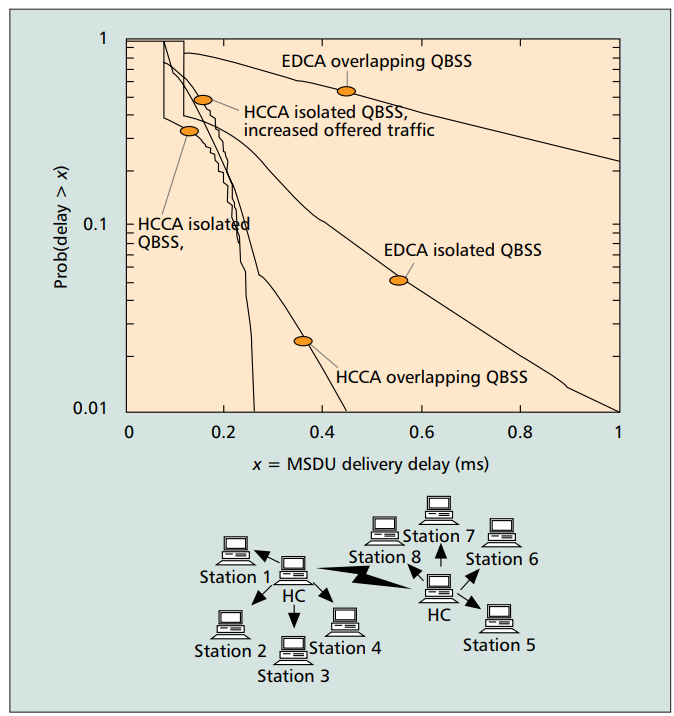

# 
 Assignment 3 

- [ Assignment 3 ](#-assignment-3-)
  - [1. Introduction](#1-introduction)
  - [2. Description of the Original Study](#2-description-of-the-original-study)
  - [3. Simulation Descriptions](#3-simulation-descriptions)
    - [Simulation 1: Achievable EDCA Throughput in an Isolated QBSS with Four Stations.](#simulation-1-achievable-edca-throughput-in-an-isolated-qbss-with-four-stations)
    - [Simulation 2: Achievable EDCA Throughput with Increasing Number of Stations.](#simulation-2-achievable-edca-throughput-with-increasing-number-of-stations)
    - [Simulation 3: QoS Guarantees with Prioritized Access of HC](#simulation-3-qos-guarantees-with-prioritized-access-of-hc)

## 1. Introduction

**The pupose of the work:** Duplicate the research paper [result](https://ieeexplore.ieee.org/document/1265851) in the NS-3 simmulator.

**The research paper:** [Performance analysis of the IEEE 802.11e EDCA for QoS support in wireless LANs](https://ieeexplore.ieee.org/document/1265851)

## 2. Description of the Original Study

The study "Analysis of IEEE 802.11e for QoS Support in Wireless LANs" focuses on evaluating the improvements introduced by the IEEE 802.11e standard to support Quality of Service (QoS) in wireless LANs. The older IEEE 802.11 standards, like 802.11a/b/g, mainly provide best-effort service, which isn't enough for applications needing guaranteed service levels, such as voice and video streaming.

To solve this, the IEEE 802.11 working group made enhancements to the MAC protocol, resulting in the 802.11e standard. This standard adds new mechanisms, specifically the Enhanced Distributed Channel Access (EDCA) and the Hybrid Coordination Function (HCF), which includes both contention-based and contention-free access methods.

The original study explains these enhancements and evaluates their ability to support QoS through simulations. It compares the performance of the 802.11e mechanisms with the older 802.11 standard, showing how 802.11e improves handling different traffic types and prioritizing network access for various applications.

Key points from the study include:

- The limitations of the older 802.11 standards in supporting QoS.
- Detailed descriptions of the new QoS mechanisms in 802.11e.
- Simulation results demonstrating how well 802.11e provides QoS under different network conditions.

The simulations show that the 802.11e standard significantly improves the ability of WLANs to support QoS, making it better suited for applications that require reliable and prioritized data transmission.

## 3. Simulation Descriptions

### Simulation 1: Achievable EDCA Throughput in an Isolated QBSS with Four Stations.

In the first simulation, the study evaluates the achievable throughput in an isolated QoS Basic Service Set (QBSS) with four stations. Each station operates under the Enhanced Distributed Channel Access (EDCA) mechanism. The access point (AP) transmits four separate data streams to each of the three stations, amounting to a total of 12 streams. All frames are transmitted at a rate of 24 Mb/s, control frames are transmitted at 6 Mb/s and the default EDCA parameters for the four access categories (AC_VI, AC_VO, AC_BE, and AC_BK) are used. MSDUs size - 512 byte. The arrival of packets follows Poisson process with certain lambda. No RTS/CTS or fragmentation is applied, and each EDCA-TXOP allows the transmission of one data frame. The simulation shows how higher priority access categories (AC_VI and AC_VO) restrict the throughput of lower priority categories (AC_BE and AC_BK) due to smaller values of AIFSN, CWmin, and CWmax, thus demonstrating the prioritization capabilities of EDCA.
**Used EDCA parameters:**

  

**Simulation Results:**

  

### Simulation 2: Achievable EDCA Throughput with Increasing Number of Stations.

The second simulation explores the performance of EDCA as the number of stations increases in an isolated QBSS. Here, each station uses all four access categories (ACs), each transmitting at 250 kb/s, totaling 1 Mb/s per station. The number of stations contending for the medium is gradually increased up to 16. The results indicate a dramatic reduction in throughput as the number of stations grows, especially for the highest priority AC_VO, due to increased collision probabilities. This outcome highlights the challenges in maintaining QoS with a high number of stations and the necessity for dynamic adjustment of EDCA parameters by the Hybrid Coordinator (HC) to manage medium access efficiently.

**Simulation Results:**

  

### Simulation 3: QoS Guarantees with Prioritized Access of HC

The third simulation investigates the QoS guarantees provided by the Hybrid Coordination Function Controlled Channel Access (HCCA) in both isolated and overlapping QBSS scenarios. The focus is on the delivery delays of MSDUs under different conditions. The simulation compares the performance of EDCA and HCCA, showing that HCCA can effectively deliver time-bounded traffic with controlled delays in isolated QBSS. However, in overlapping QBSS, the HCCA's effectiveness diminishes due to lack of coordination between overlapping cells, leading to increased delays. This underscores the importance of proper HC configuration and coordination to ensure QoS in dense network.

**Simulation Results:**

  

