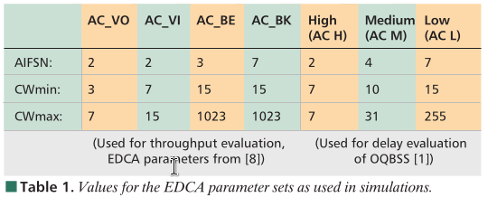
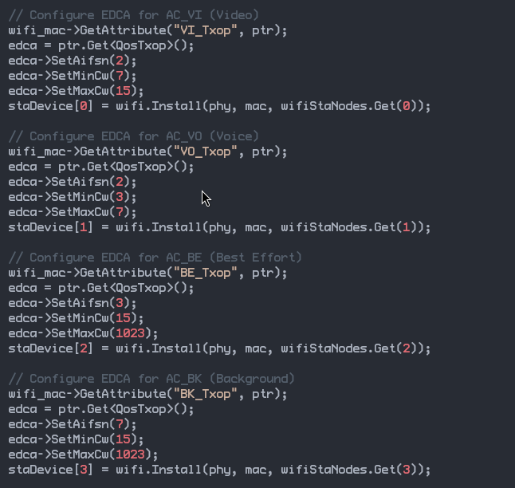
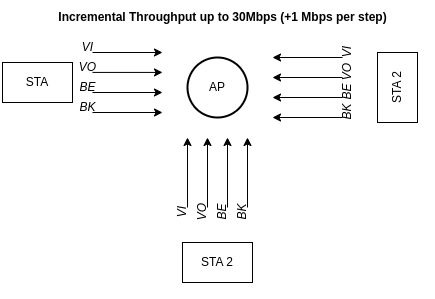
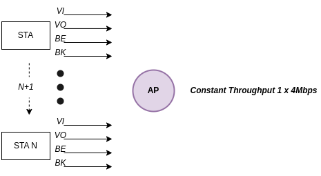
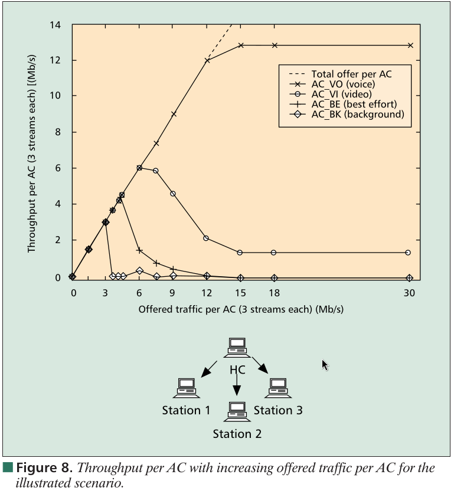
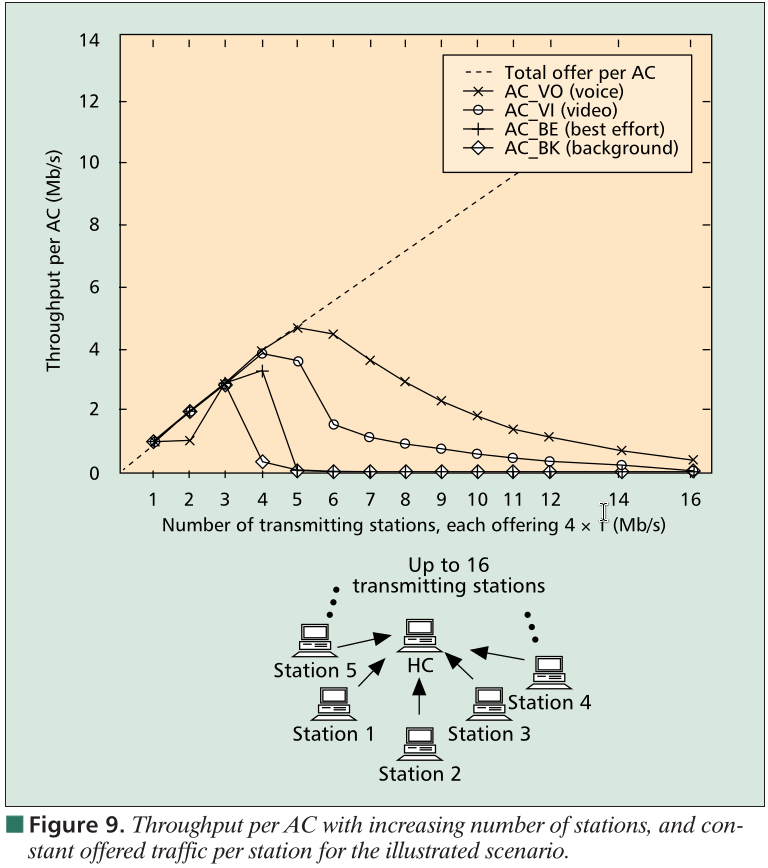
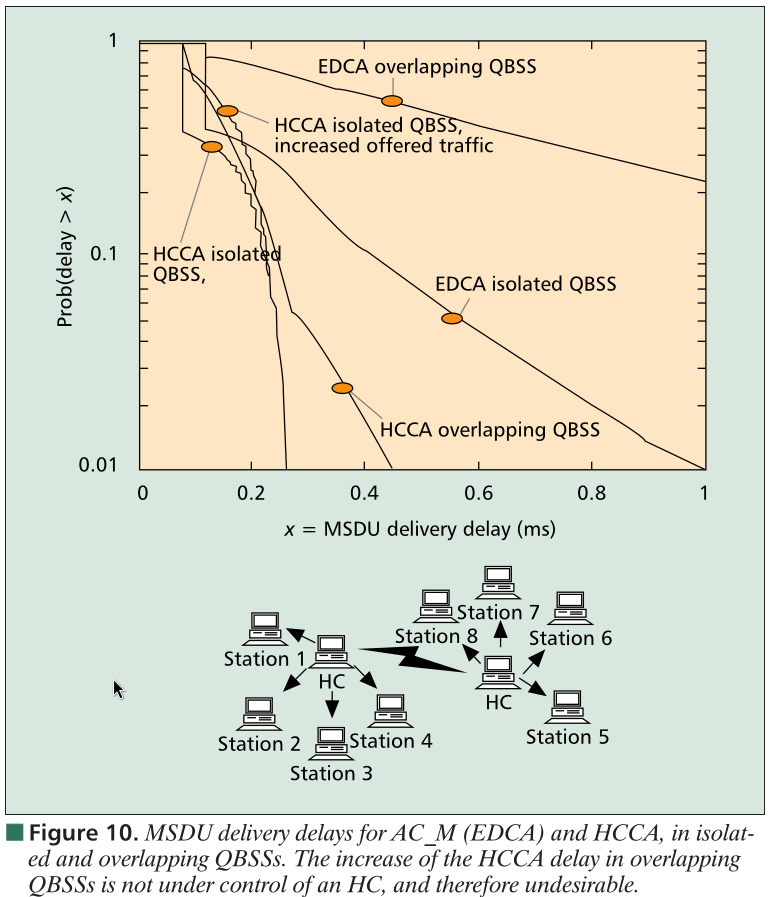
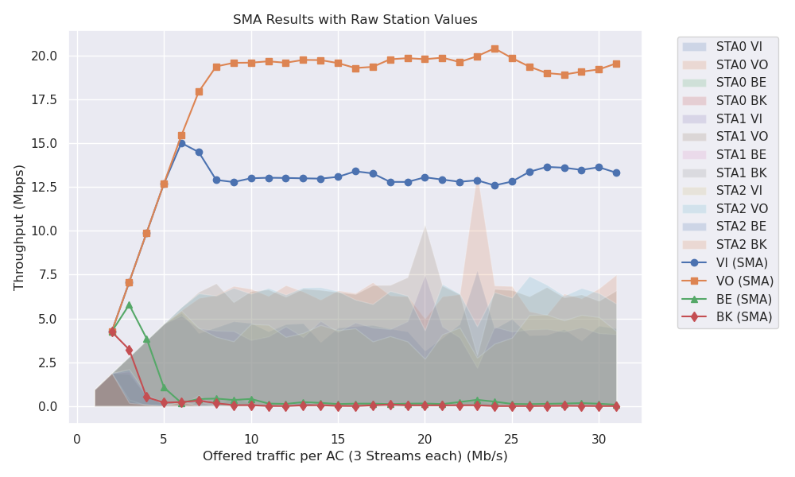
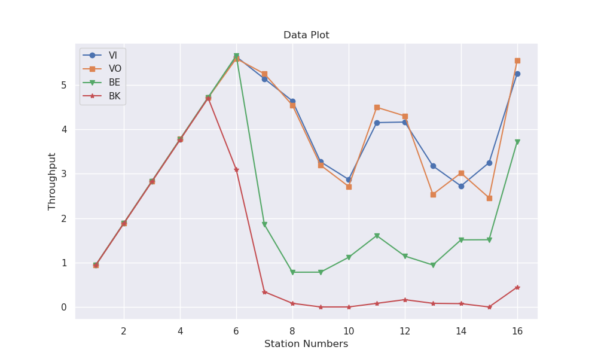

# A3 Study Notes


<!-- vim-markdown-toc Redcarpet -->

* [Introduction](#introduction)
* [Experiment Setup](#experiment-setup)
    * [**Scenario I:**](#scenario-i)
    * [**Scenario II**](#scenario-ii)
* [Experiments Result](#experiments-result)
        * [Scenario I](#scenario-i)
        * [Scenario II](#scenario-ii)
* [Appendix](#appendix)
    * [Python Plotter](#python-plotter)
    * [Source Code](#source-code)

<!-- vim-markdown-toc -->

## Introduction

This project utilizes ns-3, a discrete-event network simulator for Internet systems, to evaluate the performance of various wireless scenarios. ns-3 provides a comprehensive set of models for simulating different aspects of network communication, including the physical layer, network layer, and application layer.

One crucial aspect of network communication is Quality of Service (QoS), which refers to the ability of a network to provide different levels of service to different types of traffic. The 802.11e amendment to the IEEE 802.11 standard introduced QoS mechanisms for wireless local area networks (WLANs), enabling prioritization and differentiated treatment of traffic based on their access categories (ACs).

The 802.11e standard defines four ACs for prioritizing traffic:

- Voice (AC_VO): High-priority traffic for voice applications, such as VoIP.
- Video (AC_VI): High-priority traffic for video applications, such as video conferencing.
- Best Effort (AC_BE): Standard priority traffic for general data applications, such as web browsing.
- Background (AC_BK): Low-priority traffic for background applications, such as file transfers.

## Experiment Setup


- We set the AIFSN, MinCW and MaxCW according to the paper's recommendation.

- We are using `802.11a` as PHY layer.

  

  

### **Scenario I:**



1. Each station generates the same mixture of offered traffic consisting of four data streams, labeled according to the known Access Categories (ACs).
2. The offered traffic from each station is a mixture of the four ACs: Voice (AC_VO), Video (AC_VI), Best Effort (AC_BE), and Background (AC_BK).
3. On each iteration, the offered traffic from each station is increased according to the iteration number, while keeping the proportions of the four ACs constant.
4.On each iteration the offered traffic will be increased according to the iteration number

### **Scenario II**



1. Initially, a fixed number of stations generate a constant offered traffic, with each station's traffic being a mixture of the four ACs.
2. With each iteration, the number of stations is increased, while the offered traffic per station remains constant.
3. This scenario evaluates the throughput per AC as the number of stations (and consequently, the overall network load) increases.

## Experiments Result

The experiments aim to investigate:

1. Scenario I: The impact of increasing offered traffic on the throughput and performance of the different ACs within a fixed number of stations.
2. Scenario II: The effect of increasing the number of stations (and network load) on the throughput and performance of the different ACs, while keeping the offered traffic per station constant.


|                  *Scenario 1*                  |                ***Scenario 2***                |                   Scenario 3                   |
| :--------------------------------------------: | :--------------------------------------------: | :--------------------------------------------: |
|  |  |  |
|               :white_check_mark:               |               :white_check_mark:               |                   :warning:                    |

#### Scenario I


| TPUT | STA0     |          |            |           | STA1     |          |            |           | STA2     |          |            |            | STA3         |              |              |              |
| ---- | -------- | -------- | ---------- | --------- | -------- | -------- | ---------- | --------- | -------- | -------- | ---------- | ---------- | ------------ | ------------ | ------------ | ------------ |
| TPUT | VI       | VO       | BE         | BK        | VI       | VO       | BE         | BK        | VI       | VO       | BE         | BK         | VI           | VO           | BE           | BK           |
| 1    | 0.945292 | 0.945393 | 0.945605   | 0.941842  | 0.945191 | 0.945799 | 0.944819   | 0.942214  | 0.945525 | 0.945702 | 0.944917   | 0.942125   | 0.0000000000 | 0.0000000000 | 0.0000000000 | 0.0000000000 |
| 2    | 1.88536  | 1.88545  | 1.88474    | 1.88114   | 1.88851  | 1.8887   | 1.88669    | 1.8842    | 1.88888  | 1.88893  | 1.88744    | 1.88363    | 0.0000000000 | 0.0000000000 | 0.0000000000 | 0.0000000000 |
| 3    | 2.82525  | 2.82897  | 1.83634    | 0.265054  | 2.81536  | 2.82267  | 1.98277    | 0.36049   | 2.82446  | 2.82868  | 2.08999    | 0.177334   | 0.0000000000 | 0.0000000000 | 0.0000000000 | 0.0000000000 |
| 4    | 3.76886  | 3.76382  | 0.568108   | 0.0885580 | 3.75795  | 3.75988  | 0.569208   | 0.0373570 | 3.76761  | 3.77092  | 0.678231   | 0.094668   | 0.0000000000 | 0.0000000000 | 0.0000000000 | 0.0000000000 |
| 5    | 4.69391  | 4.69956  | 0.0910530  | 0.0340120 | 4.70196  | 4.70947  | 0.109392   | 0.134091  | 4.70077  | 4.70577  | 0.10131    | 0          | 0.0000000000 | 0.0000000000 | 0.0000000000 | 0.0000000000 |
| 6    | 5.31259  | 5.4646   | 0.00934500 | 0.0173550 | 5.16491  | 5.64959  | 0.0342450  | 0         | 5.45216  | 5.65254  | 0.0215500  | 0.270818   | 0.0000000000 | 0.0000000000 | 0.0000000000 | 0.0000000000 |
| 7    | 4.1643   | 6.1661   | 0.0811610  | 0.0672650 | 4.43952  | 6.52144  | 0.614914   | 0.265076  | 4.45604  | 6.42928  | 0.0429320  | 0          | 0.0000000000 | 0.0000000000 | 0.0000000000 | 0.0000000000 |
| 8    | 4.49461  | 6.33558  | 0.0859170  | 0         | 4.30774  | 7.00523  | 0.00701300 | 0         | 3.95174  | 6.30617  | 0.0219570  | 0          | 0.0000000000 | 0.0000000000 | 0.0000000000 | 0.0000000000 |
| 9    | 4.83698  | 6.85347  | 0.514821   | 0.0892110 | 4.28313  | 5.92753  | 0.0340740  | 0         | 3.69461  | 6.74914  | 0.0305260  | 0.0115590  | 0.0000000000 | 0.0000000000 | 0.0000000000 | 0.0000000000 |
| 10   | 4.73712  | 6.68911  | 0.181607   | 0         | 3.76715  | 6.56586  | 0.0207680  | 0         | 4.68295  | 6.41257  | 0.0325160  | 0.00725100 | 0.0000000000 | 0.0000000000 | 0.0000000000 | 0.0000000000 |
| 11   | 4.26078  | 6.28495  | 0.0362790  | 0         | 3.97331  | 6.6535   | 0          | 0         | 4.64112  | 6.74556  | 0.0171150  | 0          | 0.0000000000 | 0.0000000000 | 0.0000000000 | 0.0000000000 |
| 12   | 4.67428  | 6.89711  | 0.0261300  | 0         | 4.54183  | 6.24299  | 0.104558   | 0         | 3.94842  | 6.36453  | 0.0591610  | 0          | 0.0000000000 | 0.0000000000 | 0.0000000000 | 0.0000000000 |
| 13   | 4.72803  | 6.53456  | 0          | 0         | 3.93483  | 6.70185  | 0          | 0         | 4.16908  | 6.77093  | 0.255798   | 0.0914530  | 0.0000000000 | 0.0000000000 | 0.0000000000 | 0.0000000000 |
| 14   | 3.64503  | 6.0712   | 0          | 0         | 4.85799  | 6.6279   | 0.0663470  | 0         | 4.62717  | 6.78498  | 0.042423   | 0.0145090  | 0.0000000000 | 0.0000000000 | 0.0000000000 | 0.0000000000 |
| 15   | 4.4765   | 6.602    | 0.0909310  | 0         | 4.22432  | 6.50621  | 0.0186130  | 0         | 4.32834  | 6.55917  | 0.0119590  | 0.00299300 | 0.0000000000 | 0.0000000000 | 0.0000000000 | 0.0000000000 |
| 16   | 4.56211  | 6.45256  | 0.103074   | 0         | 4.76571  | 6.39518  | 0.0286560  | 0         | 4.43847  | 6.07344  | 0.0242480  | 0          | 0.0000000000 | 0.0000000000 | 0.0000000000 | 0.0000000000 |
| 17   | 4.62397  | 7.0664   | 0.0612680  | 0         | 4.4816   | 6.90467  | 0.0614210  | 0.0892790 | 3.68587  | 5.82498  | 0          | 0          | 0.0000000000 | 0.0000000000 | 0.0000000000 | 0.0000000000 |
| 18   | 4.41703  | 6.3123   | 0          | 0         | 4.38599  | 6.91153  | 0.0625940  | 0         | 3.99214  | 6.56456  | 0.0344550  | 0.0905760  | 0.0000000000 | 0.0000000000 | 0.0000000000 | 0.0000000000 |
| 19   | 4.26424  | 6.2641   | 0.0701550  | 0         | 4.83933  | 7.35805  | 0.021527   | 0         | 3.68504  | 6.30109  | 0.0868010  | 0          | 0.0000000000 | 0.0000000000 | 0.0000000000 | 0.0000000000 |
| 20   | 3.15853  | 4.98784  | 0.0150870  | 0         | 7.47179  | 10.3533  | 0.0915290  | 0.0840480 | 2.69703  | 4.3273   | 0.00755400 | 0          | 0.0000000000 | 0.0000000000 | 0.0000000000 | 0.0000000000 |
| 21   | 3.89093  | 6.26332  | 0          | 0         | 4.53943  | 6.87044  | 0          | 0         | 4.09216  | 6.96643  | 0.114552   | 0          | 0.0000000000 | 0.0000000000 | 0.0000000000 | 0.0000000000 |
| 22   | 4.68649  | 6.38004  | 0.216724   | 0.0920350 | 3.91529  | 6.37826  | 0.0567820  | 0         | 4.47771  | 6.4098   | 0.0685800  | 0          | 0.0000000000 | 0.0000000000 | 0.0000000000 | 0.0000000000 |
| 23   | 7.74744  | 13.3126  | 0.358471   | 0         | 2.18331  | 2.90627  | 0.00508200 | 0         | 2.7592   | 4.54681  | 0.00982400 | 0          | 0.0000000000 | 0.0000000000 | 0.0000000000 | 0.0000000000 |
| 24   | 4.4204   | 6.88091  | 0.102639   | 0         | 4.52259  | 6.68836  | 0          | 0         | 3.55761  | 6.49538  | 0.0280290  | 0          | 0.0000000000 | 0.0000000000 | 0.0000000000 | 0.0000000000 |
| 25   | 4.96924  | 6.84772  | 0.0270600  | 0         | 4.25534  | 6.62314  | 0.0466110  | 0         | 3.89998  | 6.1899   | 0.0439070  | 0          | 0.0000000000 | 0.0000000000 | 0.0000000000 | 0.0000000000 |
| 26   | 4.04047  | 5.40612  | 0.0196030  | 0         | 4.36842  | 6.26273  | 0.01957    | 0         | 5.19953  | 7.42066  | 0.0618150  | 0          | 0.0000000000 | 0.0000000000 | 0.0000000000 | 0.0000000000 |
| 27   | 4.0624   | 5.19914  | 0.0222170  | 0.0129090 | 4.3996   | 6.79053  | 0.0704970  | 0         | 5.22492  | 6.93084  | 0.0615820  | 0          | 0.0000000000 | 0.0000000000 | 0.0000000000 | 0.0000000000 |
| 28   | 4.39073  | 6.41476  | 0.0161650  | 0         | 4.24302  | 6.20553  | 0.0656950  | 0.0151030 | 4.8878   | 6.29788  | 0.053396   | 0          | 0.0000000000 | 0.0000000000 | 0.0000000000 | 0.0000000000 |
| 29   | 3.73586  | 6.14568  | 0.0794510  | 0         | 4.49531  | 6.36902  | 0.0290000  | 0         | 5.20587  | 6.7357   | 0.0912430  | 0          | 0.0000000000 | 0.0000000000 | 0.0000000000 | 0.0000000000 |
| 30   | 4.58466  | 6.71181  | 0          | 0         | 4.15906  | 6.01259  | 0          | 0         | 5.07694  | 6.4494   | 0.06596    | 0          | 0.0000000000 | 0.0000000000 | 0.0000000000 | 0.0000000000 |
| 31   | 4.43815  | 7.49688  | 0.0354870  | 0         | 4.1015   | 6.60126  | 0.00764400 | 0         | 4.27881  | 5.84265  | 0.0434220  | 0          | 0.0000000000 | 0.0000000000 | 0.0000000000 | 0.0000000000 |

1. Paper Result

​	

2. Experiment Result

   


#### Scenario II

| STA NUM | VI       | VO       | BE       | BK        |
| ------- | -------- | -------- | -------- | --------- |
| 1       | 0.945753 | 0.945875 | 0.945637 | 0.942663  |
| 2       | 1.89101  | 1.89092  | 1.89025  | 1.8841    |
| 3       | 2.8358   | 2.83695  | 2.8349   | 2.82568   |
| 4       | 3.78009  | 3.78187  | 3.77906  | 3.76588   |
| 5       | 4.72108  | 4.71405  | 4.72187  | 4.70507   |
| 6       | 5.63923  | 5.59576  | 5.66163  | 3.0945    |
| 7       | 5.14238  | 5.25391  | 1.85781  | 0.342582  |
| 8       | 4.64074  | 4.54441  | 0.782383 | 0.0818590 |
| 9       | 3.27106  | 3.19485  | 0.783813 | 0         |
| 10      | 2.87331  | 2.71573  | 1.11815  | 0         |
| 11      | 4.15294  | 4.49783  | 1.60747  | 0.0809160 |
| 12      | 4.16562  | 4.30358  | 1.14665  | 0.164421  |
| 13      | 3.17697  | 2.53746  | 0.945069 | 0.0818530 |
| 14      | 2.72508  | 3.01762  | 1.51162  | 0.0749050 |
| 15      | 3.25032  | 2.45993  | 1.51442  | 0         |
| 16      | 5.25929  | 5.55021  | 3.7221   | 0.445217  |




## Appendix

### Python Plotter

```python
import csv
import numpy as np
import matplotlib.pyplot as plt
import seaborn as sns

sns.set_theme(style="darkgrid")
#sns.set_context("paper")

def moving_average(data, window_size):
    return np.convolve(data, np.ones(window_size) / window_size, mode='valid')

def plot1():
    # Specify the path to the CSV file
    #csv_file_path = 'logs/final-data/scenario-00.csv'
    csv_file_path = 'logs/case-00-log_file_01.csv'
    
    # Read the CSV data from the file
    with open(csv_file_path, 'r') as file:
        reader = csv.reader(file)
    
        # Extract the header and data rows
        header = next(reader)  # Skip the header row
        data_rows = list(reader)
    
    # Get the number of TPUTs and stations
    num_tputs = len(data_rows) - 1  # Subtract 1 to exclude the header row
    num_stations = len(header) // 4 - 1
    
    # Create arrays to store the summed values for each station
    summed_data = {
        'VI': np.zeros(num_tputs),
        'VO': np.zeros(num_tputs),
        'BE': np.zeros(num_tputs),
        'BK': np.zeros(num_tputs)
    }
    
    # Sum the values for each station
    for i in range(1, num_tputs + 1):  # Start from index 1 to skip the header row
        for j in range(num_stations):
            vi_value = float(data_rows[i][j * 4 + 1]) if data_rows[i][j * 4 + 1] != '-0' else 0.0
            vo_value = float(data_rows[i][j * 4 + 2]) if data_rows[i][j * 4 + 2] != '-0' else 0.0
            be_value = float(data_rows[i][j * 4 + 3]) if data_rows[i][j * 4 + 3] != '-0' else 0.0
            bk_value = float(data_rows[i][j * 4 + 4]) if data_rows[i][j * 4 + 4] != '-0' else 0.0
    
            summed_data['VI'][i - 1] += vi_value  # Subtract 1 from the index to account for skipping the header row
            summed_data['VO'][i - 1] += vo_value
            summed_data['BE'][i - 1] += be_value
            summed_data['BK'][i - 1] += bk_value
    
    # Apply SMA to the summed data
    window_size = 2
    sma_data = {
        'VI': moving_average(summed_data['VI'], window_size),
        'VO': moving_average(summed_data['VO'], window_size),
        'BE': moving_average(summed_data['BE'], window_size),
        'BK': moving_average(summed_data['BK'], window_size)
    }
    
    # Generate TPUT values for plotting
    tputs = list(range(window_size, num_tputs + 1))
    
    # Apply Seaborn neat theme
    
    # Create a plot using Matplotlib
    plt.figure(figsize=(10, 6))
    
    # Plot the raw values of each station as shaded areas
    for i in range(num_stations):
        vi_values = [float(data_rows[j][i * 4 + 1]) if data_rows[j][i * 4 + 1] != '-0' else 0.0 for j in range(1, num_tputs + 1)]
        vo_values = [float(data_rows[j][i * 4 + 2]) if data_rows[j][i * 4 + 2] != '-0' else 0.0 for j in range(1, num_tputs + 1)]
        be_values = [float(data_rows[j][i * 4 + 3]) if data_rows[j][i * 4 + 3] != '-0' else 0.0 for j in range(1, num_tputs + 1)]
        bk_values = [float(data_rows[j][i * 4 + 4]) if data_rows[j][i * 4 + 4] != '-0' else 0.0 for j in range(1, num_tputs + 1)]
    
        plt.fill_between(range(1, num_tputs + 1), 0, vi_values, alpha=0.2, label=f'STA{i} VI')
        plt.fill_between(range(1, num_tputs + 1), 0, vo_values, alpha=0.2, label=f'STA{i} VO')
        plt.fill_between(range(1, num_tputs + 1), 0, be_values, alpha=0.2, label=f'STA{i} BE')
        plt.fill_between(range(1, num_tputs + 1), 0, bk_values, alpha=0.2, label=f'STA{i} BK')
    
    # Plot the SMA data
    plt.plot(tputs, sma_data['VI'], marker='o', label='VI (SMA)')
    plt.plot(tputs, sma_data['VO'], marker='s', label='VO (SMA)')
    plt.plot(tputs, sma_data['BE'], marker='^', label='BE (SMA)')
    plt.plot(tputs, sma_data['BK'], marker='d', label='BK (SMA)')
    
    plt.xlabel('Offered traffic per AC (3 Streams each) (Mb/s)')
    plt.ylabel('Throughput (Mbps)')
    plt.title('SMA Results with Raw Station Values')
    plt.legend(bbox_to_anchor=(1.05, 1), loc='upper left')
    
    # Display the plot
    plt.tight_layout()
    plt.show()

def plot2():
    csv_file_path = 'logs/case-01-log_file_01.csv'
    with open(csv_file_path, 'r') as file:
        reader = csv.reader(file)

        # Skip the header row
        next(reader)

        # Extract the data into separate lists
        sta_num = []
        vi = []
        vo = []
        be = []
        bk = []

        for row in reader:
            sta_num.append(int(row[0]))
            vi.append(float(row[1]))
            vo.append(float(row[2]))
            be.append(float(row[3]))
            bk.append(float(row[4]))

    # Plot the data
    plt.figure(figsize=(10, 6))
    plt.plot(sta_num, vi, marker='o', label='VI')
    plt.plot(sta_num, vo, marker='s', label='VO')
    plt.plot(sta_num, be, marker='v', label='BE')
    plt.plot(sta_num, bk, marker='*', label='BK')
    
    # Add labels and title
    plt.xlabel('Station Numbers')
    plt.ylabel('Throughput')
    plt.title('Data Plot')
    plt.legend(bbox_to_anchor=(1.05, 1), loc='upper left')
    plt.legend()
    
    # Show the plot
    plt.show()

plot1()
plot2()

```

### Source Code

- [Simulated Code](../codes/mwn-a3-80211a-sim.cc)

